<!-- README.md is generated from README.Rmd. Please edit that file -->

```{r, include=FALSE}
options(width = 80)
knitr::opts_chunk$set(
  collapse = TRUE,
  comment = "#>",
  fig.path = "README_files/"
)
REBUILD = TRUE
RECREATE_ALL_2DFIGS = FALSE
```

# How to use

Just load the package with `devtools::load_all()`. Or install with `remotes::install_github("slds-lmu/vistool", ref = "main")` for a permanent installation.

```{r, messages=FALSE, warnings=FALSE}
devtools::load_all(quiet = TRUE)
```

# Class structure

```{}
├── VizObject
    ├── VizObjectOptim
    ├── VizObjectPrediction
    └── VizObjectLoss
├── Optimizer
└── Visualizer
    ├── VisualizerOptim
    ├── VisualizerPrediction
    └── VisualizerLoss
```

# Objective

## Dictionary

```{r}
as.data.table(tfun_dict)
```

## Objective class

```{r}
# Get an objective:
obj = tfun_dict$get("TF_branin")

# Evaluate the objective at point x:
x = c(0.9, 1)
obj$eval(x)

# Use `$evalStore()` to add the evaluated point, function value, and further information
# into the objectives archive:
obj$archive
obj$evalStore(x)
obj$archive

# The gradient and Hessian at point x can be extracted by:
obj$grad(x)
obj$hess(x)
```

## Visualizing the objective:

For now, visualizing objectives is just possible for 2-dimensional functions. The `Visualizer` class automatically does all the visualization stuff for you:

```{r}
viz = Visualizer$new(obj)
```

For now, just the objective is defined but no graphical layers. The basic layer for 2d functions are contour lines and a 3d surface plot:
```{r, eval=FALSE}
# Contour:
viz$initLayerContour()
viz$plot()
```
```{r, eval=REBUILD, include=FALSE}
viz$initLayerContour()
viz$save("README_files/obj1.png")
```
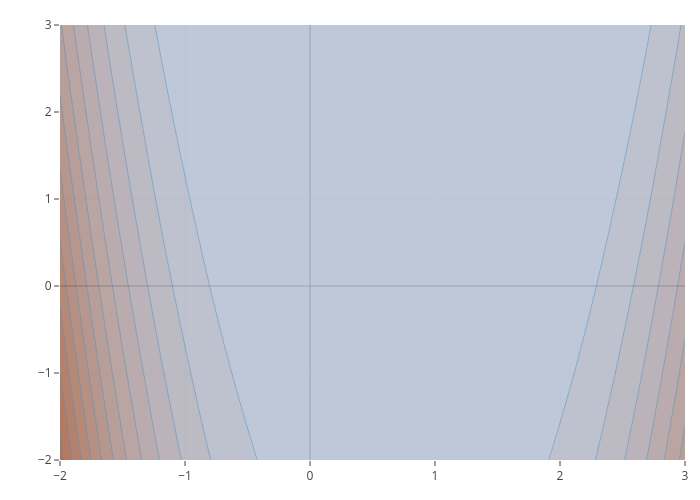

```{r, eval=FALSE}
# Surface:
viz$initLayerSurface()
viz$plot()
```
```{r, eval=REBUILD, include=FALSE}
viz$initLayerSurface()
viz$save("README_files/obj2.png")
```
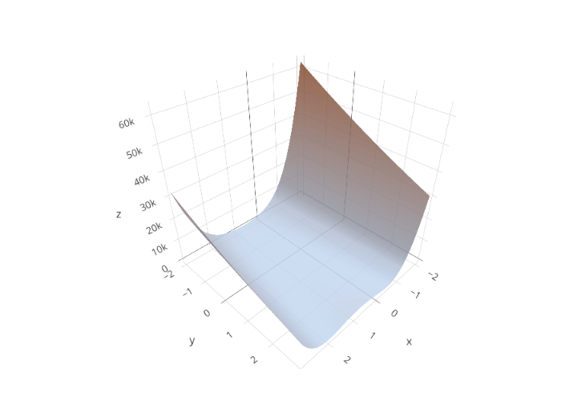

## Custom objectives

Let's define a loss for a linear model on the iris data with target `Sepal.Width` and feature `Petal.Width`. First, an `Objective` requires a function for evaluation:

```{r}
# Define the linear model loss function as SSE:
mylm = function(x, Xmat, y) {
  l2norm(y - Xmat %*% x)
}
```

To fix the loss for the data, the `Ojbective$new()` call allows to pass custom arguments that are stored and reused in every call to `$eval()` to evaluate `fun`. So, calling `$eval(x)` internally calls `fun(x, ...)`. These arguments must be specified just once:

```{r}
# Use the iris dataset with response `Sepal.Width` and feature `Petal.Width`:
Xmat = model.matrix(~ Petal.Width, data = iris)
y = iris$Sepal.Width

# Create a new object:
obj_lm = Objective$new(id = "iris LM", fun = mylm, xdim = 2,  Xmat = Xmat, y = y, minimize = TRUE)

obj_lm$evalStore(c(1, 2))
obj_lm$evalStore(c(2, 3))
obj_lm$evalStore(coef(lm(Sepal.Width ~ Petal.Width, data = iris)))

obj_lm$archive
```

Visualize lm `Objective`:

```{r, eval=FALSE}
viz_lm = Visualizer$new(obj_lm, x1limits = c(-0.5, 5), x2limits = c(-3.2, 2.8))
viz_lm$initLayerSurface()
viz_lm$plot()
```
```{r, eval=REBUILD, include=FALSE}
viz_lm = Visualizer$new(obj_lm, x1limits = c(-0.5, 5), x2limits = c(-3.2, 2.8))
viz_lm$initLayerSurface()
viz_lm$save("README_files/viz_lm.png")
```
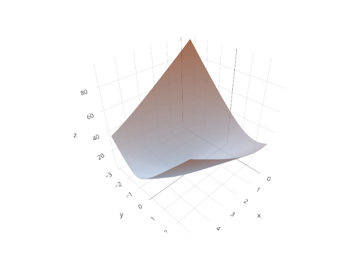

More advanced (see [More advanced](#more-advanced)) is to add points to the `plotly` object:

```{r, eval=FALSE}
x = sapply(obj_lm$archive$x, function(x) x[1])
y = sapply(obj_lm$archive$x, function(x) x[2])

viz_lm$plot() %>% add_trace(x = x, y = y, z = obj_lm$archive$fval, type = "scatter3d", mode = "markers")
```
```{r, eval=REBUILD, include=FALSE}
x = sapply(obj_lm$archive$x, function(x) x[1])
y = sapply(obj_lm$archive$x, function(x) x[2])

p = viz_lm$plot() %>% add_trace(x = x, y = y, z = obj_lm$archive$fval, type = "scatter3d", mode = "markers")
orca(p, "README_files/viz_lm_scatter.png")
```
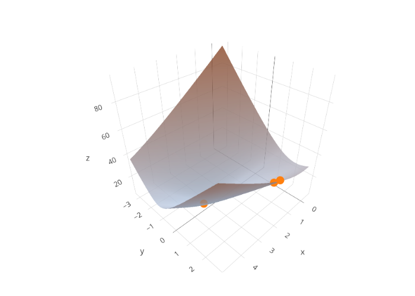

# Optimizer

## Optimizer class

The optimizer class defines the optimization strategy and is initialized by taking an objective function, start value, and learning rate. Available optimizer are:

- Gradient descent with `OptimizerGD`
- Momentum with `OptimizerMomentum`
- Nesterovs momentum with `OptimizerNAG`

Creating an optimizer is done by (let's use an x value that works well):

```{r}
obj = tfun_dict$get("TF_banana")
opt = OptimizerGD$new(obj, x_start = c(0.8, 0.6), lr = 0.01)
```

With these value set, optimization is done by calling `$optimize()` with the number of steps as argument:
```{r}
opt$optimize(10L)
```

Calling `$optimize()` also writes into the archive of the optimizer and also calls `$evalStore()` of the objective. Therefore, `$optimize()` writes into two archives:
```{r}
opt$archive
opt$objective$archive
```

We can let the algorithm run for another 10 iterations in a second batch:
```{r}
opt$optimize(10L)
```

Still not very satisfying.

## Visualize optimization traces

A layer of the `Visualizer` class is `$addLayerOptimizationTrace()` that gets the optimizer as argument and adds the optimization trace to the plot:

```{r, eval=FALSE}
viz = Visualizer$new(obj)
viz$initLayerSurface()
viz$addLayerOptimizationTrace(opt)
viz$plot()
```
```{r, eval=REBUILD, include=FALSE}
viz = Visualizer$new(obj)
viz$initLayerContour()
viz$addLayerOptimizationTrace(opt)
viz$save("README_files/obj3.png")
```
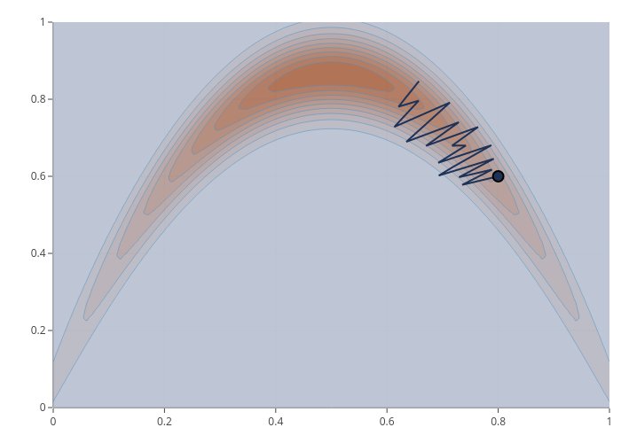

## Step size control

When calling `$optimize()`, the second argument is `stepSizeControl` that allows to expand or compress the update added to the old value of $x$. E.g., for GD with $x_{\text{new}} = x_{\text{old}} + lr * \Delta_f(x_{\text{old}})$ the update $u = lr * \Delta_f(x_{\text{old}})$ is multiplied with the return value of `stepSizeControl()`. There are a few pre-implemented control functions like line search or various decaying methods:

- `stepSizeControlLineSearch(lower, upper)`: Conduct a line search for $a$ in $x_{\text{new}} = x_{\text{old}} +  a * lr * \Delta_f(x_{\text{old}})$`.
- `stepSizeControlDecayTime(decay) `: Lower the updates by $(1 + decay * iteration)^{-1}$.
- `stepSizeControlDecayExp(decay)`: Lower the updates by $exp(-decay * iteration)$.
- `stepSizeControlDecayLinear(iter_zero)`: Lower the updates until `iter_zero` is reached. Updates with `iter > iter_zero` are 0.
- `stepSizeControlDecaySteps(drop_rate, every_iter)`: Lower the updates `every_iter` by `drop_rate`.

Note that these functions return a function that contains a function with the required signature:

```{r}
stepSizeControlDecayTime()
```

Let's define multiple gradient descent optimizers and optimize 100 steps with a step size control:

```{r}
x0 = c(0.8, 0.6)
lr = 0.01
obj = tfun_dict$get("TF_banana")

oo1 = OptimizerGD$new(obj, x_start = x0, lr = lr, id = "GD without LR Control", print_trace = FALSE)
oo2 = OptimizerGD$new(obj, x_start = x0, lr = lr, id = "GD with Line Search", print_trace = FALSE)
oo3 = OptimizerGD$new(obj, x_start = x0, lr = lr, id = "GD with Time Decay", print_trace = FALSE)
oo4 = OptimizerGD$new(obj, x_start = x0, lr = lr, id = "GD with Exp Decay", print_trace = FALSE)
oo5 = OptimizerGD$new(obj, x_start = x0, lr = lr, id = "GD with Linear Decay", print_trace = FALSE)
oo6 = OptimizerGD$new(obj, x_start = x0, lr = lr, id = "GD with Step Decay", print_trace = FALSE)

oo1$optimize(steps = 100)
oo2$optimize(steps = 100, stepSizeControlLineSearch())
oo3$optimize(steps = 100, stepSizeControlDecayTime())
oo4$optimize(steps = 100, stepSizeControlDecayExp())
oo5$optimize(steps = 100, stepSizeControlDecayLinear())
oo6$optimize(steps = 100, stepSizeControlDecaySteps())
```

For now we don't know how well it worked. Let's collect all archives with `mergeOptimArchives()` and visualize the step sizes and function values with `patchwork` magic:

```{r}
arx = mergeOptimArchives(oo1, oo2, oo3, oo4, oo5, oo6)

library(patchwork)
gg1 = ggplot(arx, aes(x = iteration, y = step_size, color = optim_id))
gg2 = ggplot(arx, aes(x = iteration, y = fval_out, color = optim_id))

(gg1 + ggtitle("Step sizes") |
 gg1 + ylim(0, 1) + ggtitle("Step sizes (zoomed)") |
 gg2 + ggtitle("Objective")) +
  plot_layout(guides = "collect") &
  geom_line() &
  theme_minimal() &
  theme(legend.position = "bottom") &
  ggsci::scale_color_simpsons()
```

Visualizing the traces is done as before by adding optimization trace layer. We can do this for all optimizers to add multiple traces to the plot (colors are picked randomly, see the [`Visualizer`](#visualizer) section for more details about plotting):

```{r, eval=FALSE}
viz = Visualizer$new(obj)
viz$initLayerContour()

viz$addLayerOptimizationTrace(oo1)
viz$addLayerOptimizationTrace(oo2)
viz$addLayerOptimizationTrace(oo3)
viz$addLayerOptimizationTrace(oo4)
viz$addLayerOptimizationTrace(oo5)
viz$addLayerOptimizationTrace(oo6)

viz$plot()
```
```{r, eval=REBUILD, include=FALSE}
viz = Visualizer$new(obj)
viz$initLayerContour()

viz$addLayerOptimizationTrace(oo1)
viz$addLayerOptimizationTrace(oo2)
viz$addLayerOptimizationTrace(oo3)
viz$addLayerOptimizationTrace(oo4)
viz$addLayerOptimizationTrace(oo5)
viz$addLayerOptimizationTrace(oo6)

viz$save("README_files/obj4.png")
```
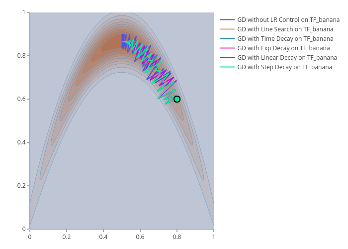

Practically, it should be no issue to also combine multiple control functions. The important thing is to keep the signature of the function by allowing the function to get the arguments `x` (current value), `u` (current update), `obj` (`Objective` object), and `opt` (`Optimizer` object):

```{r}
myStepSizeControl = function(x, u, obj, opt) {
  sc1 = stepSizeControlLineSearch(0, 10)
  sc2 = stepSizeControlDecayTime(0.1)
  return(sc1(x, u, obj, opt) * sc2(x, u, obj, opt))
}

my_oo = OptimizerGD$new(obj, x_start = x0, lr = lr, id = "GD without LR Control", print_trace = FALSE)
my_oo$optimize(100, myStepSizeControl)
tail(my_oo$archive)
```

# Visualizer

## Visualizer class

Atm, just 2 dimensional inputs are supported. The `Visualizer` class is initialized by calling `Visualizer$new(obj)` for a given `Objective`. Furhter arguments are `x1limits` and `x2limits` as well as `padding` to stretch the limits by a factor and `npoints` to specify the number of generated point per dimension, hence `npoints^2` points are evaluated to create the initial layers.

## Initial layers

An initial layer is always required to which other layers (such as optimization traces) are added step by step. The two available base layers are contour lines `$initLayerContour()` and `$initLayerSurface()`.

For both, the first argument tis the opacity and the second a colorscale:

```{r, eval=FALSE}
viz = Visualizer$new(tfun_dict$get("TF_franke"))
viz$initLayerContour(opacity = 1, colorscale = list(c(0, 1), c("rgb(176,196,222)", "rgb(160,82,45)")))
viz$plot()
```
```{r, eval=REBUILD, include=FALSE}
viz = Visualizer$new(tfun_dict$get("TF_franke"))
viz$initLayerContour(opacity = 1, colorscale = list(c(0, 1), c("rgb(176,196,222)", "rgb(160,82,45)")))
viz$save("README_files/viz1.png")
```
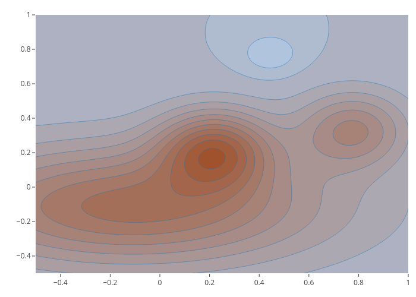

```{r, eval=FALSE}
viz = Visualizer$new(tfun_dict$get("TF_franke"))
viz$initLayerContour(colorscale = list(c(0, 1), c("white", "blue")))
viz$plot()
```
```{r, eval=REBUILD, include=FALSE}
viz = Visualizer$new(tfun_dict$get("TF_franke"))
viz$initLayerContour(colorscale = list(c(0, 1), c("white", "blue")))
viz$save("README_files/viz2.png")
```
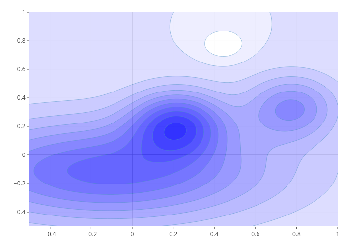

```{r, eval=FALSE}
viz = Visualizer$new(tfun_dict$get("TF_franke"))
viz$initLayerSurface(opacity = 1, colorscale = list(c(0, 1), c("white", "black")))
viz$plot()
```
```{r, eval=REBUILD, include=FALSE}
viz = Visualizer$new(tfun_dict$get("TF_franke"))
viz$initLayerSurface(opacity = 1, colorscale = list(c(0, 1), c("white", "black")))
viz$save("README_files/viz3.png")
```
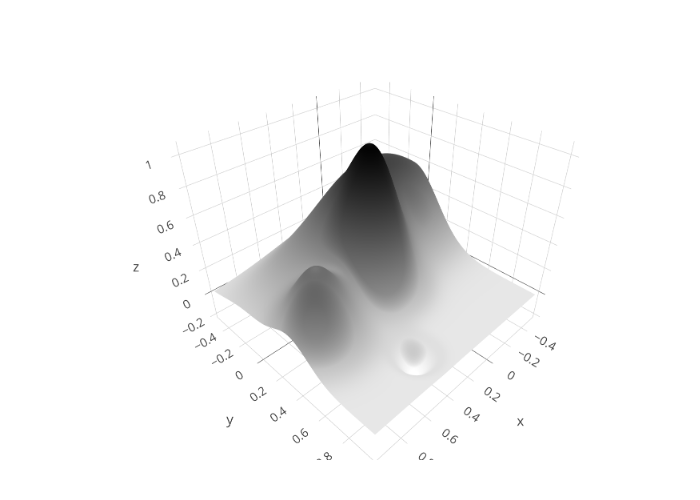

Internally, `add_trace()` from `plotly` is called. Further arguments are directly passed to it, e.g. by adding contour lines:

```{r, eval=FALSE}
viz = Visualizer$new(tfun_dict$get("TF_franke"))

# Add 10 grid lines per dim, limits (sometimes) can be obtained form the
# objective:
llower = viz$objective$limits_lower
lupper = viz$objective$limits_upper
ssize = (lupper - llower) / 10

viz$initLayerSurface(opacity = 1, colorscale = list(c(0, 1), c("white", "black")),
  contours = list(
    x = list(show = TRUE, start = llower[1], end = lupper[1], size = ssize[1], color = "black"),
    y = list(show = TRUE, start = llower[2], end = lupper[2], size = ssize[2], color = "black")))
viz$plot()
```
```{r, eval=REBUILD, include=FALSE}
viz = Visualizer$new(tfun_dict$get("TF_franke"))

# Add 10 grid lines per dim, limits (sometimes) can be obtained form the
# objective:
llower = viz$objective$limits_lower
lupper = viz$objective$limits_upper
ssize = (lupper - llower) / 10

viz$initLayerSurface(opacity = 1, colorscale = list(c(0, 1), c("white", "black")),
  contours = list(
    x = list(show = TRUE, start = llower[1], end = lupper[1], size = ssize[1], color = "black"),
    y = list(show = TRUE, start = llower[2], end = lupper[2], size = ssize[2], color = "black")))
viz$save("README_files/viz4.png")
```
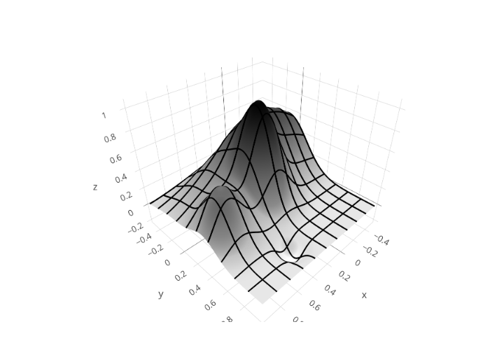

## Optimization traces

As shown previously, optimization traces can be added by `$addLayerOptimizationTrace`. Let's optimize our custom linear model objective for the three available optimizers:

```{r}
# Reset the archive to have an empty objective:
obj_lm$clearArchive()

oo1 = OptimizerGD$new(obj_lm, x_start = c(0, -0.05), lr = 0.001, print_trace = FALSE)
oo2 = OptimizerMomentum$new(obj_lm, x_start = c(-0.05, 0), lr = 0.001, print_trace = FALSE)
oo3 = OptimizerNAG$new(obj_lm, x_start = c(0, 0), lr = 0.001, print_trace = FALSE)

oo1$optimize(steps = 100)
oo2$optimize(steps = 100)
oo3$optimize(steps = 100)
```

```{r, eval=FALSE}
viz = Visualizer$new(obj_lm, x1limits = c(-0.5, 5), x2limits = c(-3.2, 2.8))

viz$initLayerContour()

viz$addLayerOptimizationTrace(oo1, add_marker_at = round(seq(1, 100, len = 10L)))
viz$addLayerOptimizationTrace(oo2, add_marker_at = c(1, 50, 90), marker_shape = c("square", "star-triangle-down", "cross"))
viz$addLayerOptimizationTrace(oo3, add_marker_at = 100, marker_shape = "star")

viz$plot()
```
```{r, eval=REBUILD, include=FALSE}
viz = Visualizer$new(obj_lm, x1limits = c(-0.5, 5), x2limits = c(-3.2, 2.8))

viz$initLayerContour()

viz$addLayerOptimizationTrace(oo1, add_marker_at = round(seq(1, 100, len = 10L)))
viz$addLayerOptimizationTrace(oo2, add_marker_at = c(1, 50, 90), marker_shape = c("square", "star-triangle-down", "cross"))
viz$addLayerOptimizationTrace(oo3, add_marker_at = 100, marker_shape = "star")

viz$save("README_files/viz5.png")
```
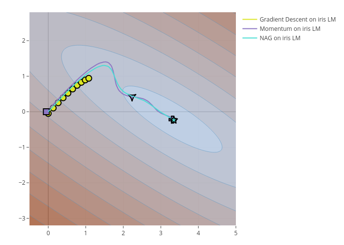


## Setting the layout and scene (TODO)

```{r}

viz$setLayout(legend = list(orientation = "h", xanchor = "center", x = 0.5))

```

## Overlaying layers (TODO)

```{r, eval=FALSE}
obj = tfun_dict$get("TF_banana")
viz = Visualizer$new(obj)
viz$initLayerSurface()

x0 = c(0.85, 0.47)
viz$addLayerTaylor(x0, npoints_per_dim = 5, degree = 1, x1margin = 0.3, x2margin = 0.3, contours = list(
    x = list(show = TRUE, start = 0, end = 1, size = 0.03, color = "black"),
    y = list(show = TRUE, start = 0, end = 1, size = 0.03, color = "black")))
viz$addLayerHessian(x0)
viz$plot()
```
```{r, eval=REBUILD, include=FALSE}
obj = tfun_dict$get("TF_banana")
viz = Visualizer$new(obj)
viz$initLayerSurface()

x0 = c(0.85, 0.47)
viz$addLayerTaylor(x0, npoints_per_dim = 5, degree = 1, x1margin = 0.3, x2margin = 0.3, contours = list(
    x = list(show = TRUE, start = 0, end = 1, size = 0.03, color = "black"),
    y = list(show = TRUE, start = 0, end = 1, size = 0.03, color = "black")))
viz$addLayerHessian(x0)
viz$save("README_files/viz6.png")
```
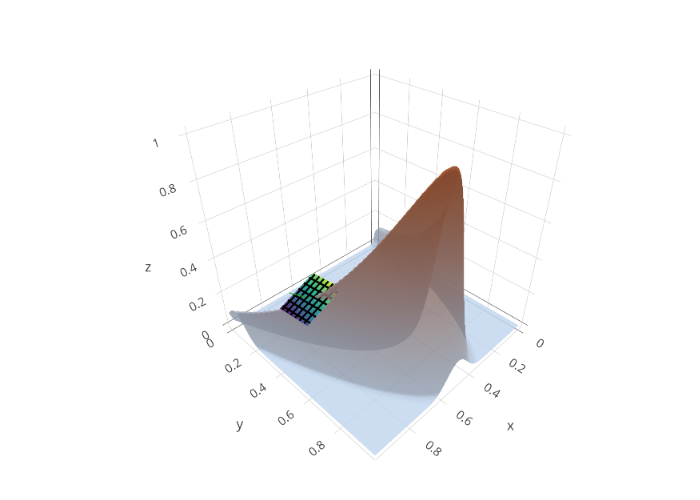

## Manual layers (TODO)

```{r}
obj = tfun_dict$get("TF_banana")
viz = Visualizer$new(obj)
viz$initLayerSurface(opacity = 0.5)
p = viz$plot()
class(p)

nsim = 100
grid = data.frame(x = runif(nsim), y = runif(nsim))
grid$z = apply(grid, 1, viz$objective$eval) + rnorm(nsim, sd = 0.05)
p = p %>% add_trace(data = grid, x = ~x, y = ~y, z = ~z, mode = "markers",
  type = "scatter3d", marker = list(symbol = "cross"))

# Save with orca:
orca(p, "README_files/viz_scatter.png")

# List of marker symbols:
head(schema(F)$traces$scatter3d$attributes$marker$symbol$values)
```
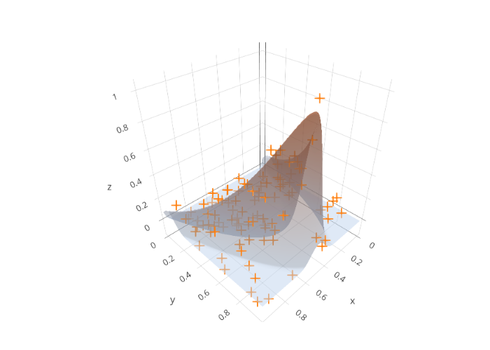

## Animations (TODO)

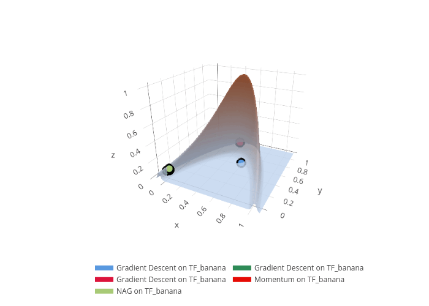


# All 2D Objectives

```{r, results="asis", echo=FALSE, warning=FALSE, message=FALSE}
dtf = as.data.table.DictionaryObjective(tfun_dict)
dtf2d = dtf[xdim == 2, ]

library(cowplot, quietly = TRUE)
library(ggplot2, quietly = TRUE)

for (key in dtf2d$key) {
  obj = tfun_dict$get(key)

  file = "README_files/%s-%s.png"
  filec = sprintf(file, obj$label, "contour")
  files = sprintf(file, obj$label, "surface")
  fileg = sprintf(file, obj$label, "gg")

  viz = Visualizer$new(obj)

  if (RECREATE_ALL_2DFIGS || (! file.exists(fileg))) {
    viz$initLayerContour()
    t1 = capture.output(suppressWarnings(suppressMessages(viz$save(filec))))

    viz$initLayerSurface()
    t2 = capture.output(suppressWarnings(suppressMessages(viz$save(files))))

    p1 = ggdraw() + draw_image(filec)
    p2 = ggdraw() + draw_image(files)

    p = plot_grid(p1, p2)

    suppressMessages(ggsave(plot = p, filename = fileg, width = 4, height = 1.5))
    file.remove(filec, files)
  }
  cat(sprintf("\n__%s__\n\n", obj$label, fileg))
}
```

