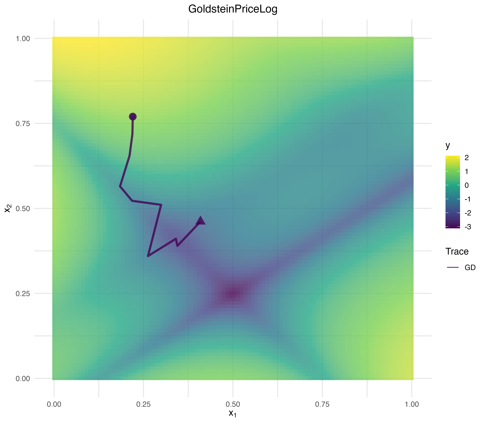

<!-- README.md is generated from README.Rmd. Please edit this file -->

# vistool

<!-- badges: start -->

[](https://github.com/slds-lmu/vistool/actions/workflows/r-cmd-check.yaml)
<!-- badges: end -->

`vistool` helps you explore optimization concepts and model behavior
with a consistent R6 API. Use it to:

- visualize regression and classification loss functions;
- inspect one- and two-dimensional objectives, including custom
  definitions;
- follow optimization traces for gradient descent, momentum, and
  Nesterov variants;
- compare model prediction surfaces and decision boundaries.

Every visualizer follows a three-step workflow: initialize with
`as_visualizer()`, add optional layers, then render via `plot()` (and
optionally `save()`).

## Example

``` r
library(vistool)

objective = obj("TF_GoldsteinPriceLog")
vis = as_visualizer(objective)
opt = OptimizerGD$new(objective, x_start = c(0.22, 0.77), lr = 0.01)
opt$optimize(10L)
#> TF_GoldsteinPriceLog: Batch 1 step 1: f(x) = 0.9158, x = c(0.219, 0.7186)
#> TF_GoldsteinPriceLog: Batch 1 step 2: f(x) = 0.4217, x = c(0.211, 0.6549)
#> TF_GoldsteinPriceLog: Batch 1 step 3: f(x) = -0.6741, x = c(0.1844, 0.5649)
#> TF_GoldsteinPriceLog: Batch 1 step 4: f(x) = -0.9819, x = c(0.2182, 0.5224)
#> TF_GoldsteinPriceLog: Batch 1 step 5: f(x) = -0.9876, x = c(0.2992, 0.5105)
#> TF_GoldsteinPriceLog: Batch 1 step 6: f(x) = -1.1018, x = c(0.2625, 0.3598)
#> TF_GoldsteinPriceLog: Batch 1 step 7: f(x) = -2.168, x = c(0.3405, 0.4107)
#> TF_GoldsteinPriceLog: Batch 1 step 8: f(x) = -2.1246, x = c(0.3448, 0.3898)
#> TF_GoldsteinPriceLog: Batch 1 step 9: f(x) = -1.3408, x = c(0.4093, 0.4614)
#> TF_GoldsteinPriceLog: Batch 1 step 10: f(x) = -2.1225, x = c(0.3729, 0.3911)
vis$add_optimization_trace(opt, name = "GD")
vis$plot()
```



## Installation

You can install the development version from GitHub with
[`pak`](https://pak.r-lib.org/):

``` r
# install.packages("pak")
pak::pak("slds-lmu/vistool")
```

Prefer base R tooling? `remotes::install_github("slds-lmu/vistool")`
works as well.

### Plotly backend, MathJax, and static export

Plotly surfaces receive MathJax automatically whenever a label contains
LaTeX markers. Control the MathJax source globally via
`options(vistool.mathjax = "cdn")` (default), `"local"` to reuse a system
installation, or a fully qualified URL when you host MathJax yourself.

Static exports no longer rely on Python or Kaleido. When you call
`save()` with an image extension, `vistool` writes a self-contained HTML
snapshot, captures it through `webshot2` (headless Chrome/Chromium), and
trims the result with `magick`. These dependencies (`htmlwidgets`,
`webshot2`, `magick`) are now imported automatically; ensure a recent
Chrome/Chromium is available on your system and `vis$save("plot.png")`
just works.

You can still call `save()` with `.html` to persist the interactive
widget directly.

Pkgdown builds automatically inherit this MathJax wiring, so no extra
`<script>` tags are required.

## Documentation roadmap

- [Loss
  functions](https://slds-lmu.github.io/vistool/articles/loss_functions.html)
  – Open when you need to compare predefined and custom regression or
  classification losses side by side.
- [Model
  predictions](https://slds-lmu.github.io/vistool/articles/model.html) –
  Visit to inspect 1D/2D mlr3 learners, add boundaries, and overlay
  training data.
- [Objective
  functions](https://slds-lmu.github.io/vistool/articles/objective.html)
  – Read when you explore built-in objectives, define custom ones, or
  visualize evaluation archives.
- [Optimization &
  traces](https://slds-lmu.github.io/vistool/articles/optimization_traces.html)
  – Use to understand optimizers, step size control, and how to display
  optimization progress.
- [Customization
  guide](https://slds-lmu.github.io/vistool/articles/customization_guide.html)
  – Start here when you want to tweak themes, colors, and styling
  precedence.
- [Advanced
  visualization](https://slds-lmu.github.io/vistool/articles/advanced_visualization.html)
  – Open for surface overlays, manual plot augmentations, and animation
  workflows.

## Contributing

For anyone interested in contributing to `vistool`, please see the
[Developer reference](DEVELOPMENT.md).
