<!-- README.md is generated from README.Rmd. Please edit that file -->

# Vistool

## Usage

``` r
devtools::load_all()
#> ℹ Loading vistool
#> Loading required package: R6
#> 
#> Loading required package: rootSolve
#> 
#> Loading required package: checkmate
#> 
#> Loading required package: data.table
#> 
#> data.table 1.14.6 using 4 threads (see ?getDTthreads).  Latest news: r-datatable.com
#> 
#> Loading required package: colorspace
#> 
#> Loading required package: mlr3misc
#> 
#> Loading required package: TestFunctions
#> 
#> Loading required package: plotly
#> 
#> Loading required package: ggplot2
#> 
#> 
#> Attaching package: 'plotly'
#> 
#> 
#> The following object is masked from 'package:ggplot2':
#> 
#>     last_plot
#> 
#> 
#> The following object is masked from 'package:stats':
#> 
#>     filter
#> 
#> 
#> The following object is masked from 'package:graphics':
#> 
#>     layout
#> 
#> 
#> Loading required package: stringr
#> 
#> 
#> Attaching package: 'stringr'
#> 
#> 
#> The following object is masked from 'package:mlr3misc':
#> 
#>     str_trunc

# Test functions dictionary:
as.data.table(tfun_dict)
#>                        key               label xdim limits_lower limits_upper
#>  1:           TF_Gfunction           Gfunction   NA           NA           NA
#>  2:      TF_GoldsteinPrice      GoldsteinPrice    2          0,0          1,1
#>  3:   TF_GoldsteinPriceLog   GoldsteinPriceLog    2          0,0          1,1
#>  4:         TF_OTL_Circuit         OTL_Circuit    6           NA           NA
#>  5:          TF_RoosArnold          RoosArnold   NA           NA           NA
#>  6:              TF_ackley              ackley    2          0,0          1,1
#>  7:              TF_banana              banana    2          0,0          1,1
#>  8:               TF_beale               beale    2          0,0          1,1
#>  9:            TF_borehole            borehole    2          0,0      1.5,1.0
#> 10:              TF_branin              branin    2        -2,-2          3,3
#> 11:          TF_currin1991          currin1991    2          0,0          1,1
#> 12:               TF_easom               easom    2          0,0          1,1
#> 13:              TF_franke              franke    2    -0.5,-0.5          1,1
#> 14:           TF_gaussian1           gaussian1   NA           NA           NA
#> 15:            TF_griewank            griewank   NA           NA           NA
#> 16:            TF_hartmann            hartmann    6           NA           NA
#> 17:                TF_hump                hump    2          0,0          1,1
#> 18:                TF_levy                levy   NA           NA           NA
#> 19:             TF_lim2002             lim2002    2          0,0          1,1
#> 20: TF_linkletter_nosignal linkletter_nosignal   NA           NA           NA
#> 21:         TF_michalewicz         michalewicz   NA           NA           NA
#> 22:              TF_piston              piston    7           NA           NA
#> 23:              TF_powsin              powsin   NA           NA           NA
#> 24:          TF_quad_peaks          quad_peaks    2          0,0          1,1
#> 25:    TF_quad_peaks_slant    quad_peaks_slant    2          0,0          1,1
#> 26:           TF_rastrigin           rastrigin   NA           NA           NA
#> 27:            TF_robotarm            robotarm    8           NA           NA
#> 28:            TF_sinumoid            sinumoid    2          0,0          1,1
#> 29:             TF_sqrtsin             sqrtsin   NA           NA           NA
#> 30:           TF_waterfall           waterfall    2          0,0          1,1
#> 31:          TF_wingweight          wingweight   10           NA           NA
#> 32:            TF_zhou1998            zhou1998    2          0,0          1,1
#>                        key               label xdim limits_lower limits_upper

# Get objective to define the "problem":
obj = tfun_dict$get("TF_banana")

# Define optimizers based on the objective and conduct 1000 steps:
oo1 = OptimizerGD$new(obj, x_start = c(0.6, 0.6), step_size = 0.001, id = "GD x0=(0.6, 0.6)", print_trace = FALSE)
oo1$optimize(steps = 1000)

oo2 = OptimizerGD$new(obj, x_start = c(0, 0), step_size = 0.001, id = "GD x0=(0, 0)", print_trace = FALSE)
oo2$optimize(steps = 1000)

oo3 = OptimizerGD$new(obj, x_start = c(0.4, 1), step_size = 0.001, id = "GD x0=(0.4, 1)", print_trace = FALSE)
oo3$optimize(steps = 1000)

oo4 = OptimizerMomentum$new(obj, x_start = c(0, 0), step_size = 0.001, print_trace = FALSE)
oo4$optimize(steps = 1000)

oo5 = OptimizerNAG$new(obj, x_start = c(0, 0), step_size = 0.001, print_trace = FALSE)
oo5$optimize(steps = 1000)

# Optimization traces are stored in the archive:
oo5$archive
#>                     x_out                x_in              update fval_out
#>    1: -0.003283, 0.001231                 0,0 -0.003283, 0.001231  0.09392
#>    2: -0.008732, 0.003367 -0.003283, 0.001231 -0.005449, 0.002136  0.10979
#>    3: -0.014160, 0.005742 -0.008732, 0.003367 -0.005427, 0.002375  0.11764
#>    4: -0.017796, 0.007793 -0.014160, 0.005742 -0.003637, 0.002051  0.11707
#>    5: -0.019140, 0.009341 -0.017796, 0.007793 -0.001344, 0.001548  0.11544
#>   ---                                                                     
#>  996:       0.5000,0.8667       0.5000,0.8667 1.159e-32,5.911e-33  1.00000
#>  997:       0.5000,0.8667       0.5000,0.8667 1.043e-32,5.320e-33  1.00000
#>  998:       0.5000,0.8667       0.5000,0.8667 9.388e-33,4.788e-33  1.00000
#>  999:       0.5000,0.8667       0.5000,0.8667 8.449e-33,4.309e-33  1.00000
#> 1000:       0.5000,0.8667       0.5000,0.8667 7.604e-33,3.878e-33  1.00000
#>       fval_in    lr       objective momentum step batch
#>    1: 0.08208 0.001 <Objective[17]>      0.9    1     1
#>    2: 0.09392 0.001 <Objective[17]>      0.9    2     1
#>    3: 0.10979 0.001 <Objective[17]>      0.9    3     1
#>    4: 0.11764 0.001 <Objective[17]>      0.9    4     1
#>    5: 0.11707 0.001 <Objective[17]>      0.9    5     1
#>   ---                                                  
#>  996: 1.00000 0.001 <Objective[17]>      0.9  996     1
#>  997: 1.00000 0.001 <Objective[17]>      0.9  997     1
#>  998: 1.00000 0.001 <Objective[17]>      0.9  998     1
#>  999: 1.00000 0.001 <Objective[17]>      0.9  999     1
#> 1000: 1.00000 0.001 <Objective[17]>      0.9 1000     1

# The Visualizer class just requires the object and sets everything such as
# limits automatically (if not you will get a message):
viz = Visualizer$new(obj)

# The two potential visualizations are surface and contour plots. The "base"
# layer is defined by `$initLayerContour()` or `$initLayerSurface()`:
viz$initLayerSurface()
```

``` r
# Creating the figure is done with `$plot()`:
viz$plot()
```

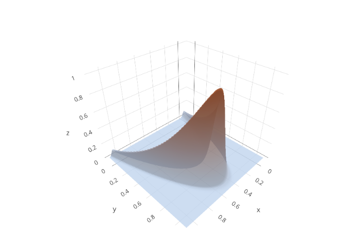

``` r
# To quickly add the optimization traces use `$addLayerOptimizationTrace(opt)`:
viz$addLayerOptimizationTrace(oo1) # The color is randomly generated if not defined
viz$addLayerOptimizationTrace(oo2, line_color = "rgb(46,139,87)")
viz$addLayerOptimizationTrace(oo3, line_color = "rgb(220,20,60)")
viz$addLayerOptimizationTrace(oo4)
viz$addLayerOptimizationTrace(oo5)
```

``` r
viz$plot()
```

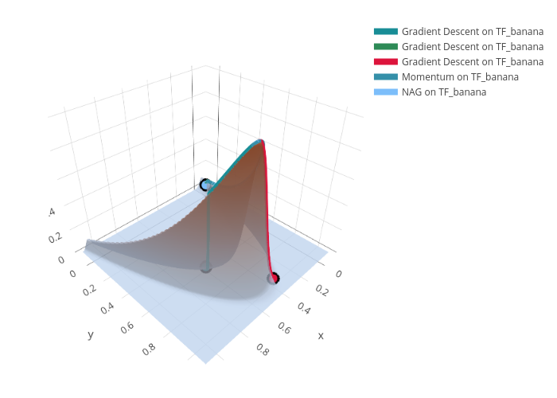

``` r
# If traces overlap, we can add an offset to slightly shift them:
viz$initLayerSurface()

viz$addLayerOptimizationTrace(oo1)
viz$addLayerOptimizationTrace(oo2, line_color = "rgb(46,139,87)", offset = c(-0.01, -0.01, -0.01))
viz$addLayerOptimizationTrace(oo3, line_color = "rgb(220,20,60)")
viz$addLayerOptimizationTrace(oo4, offset = c(0.01, 0.01, -0.01))
viz$addLayerOptimizationTrace(oo5, offset = c(0.01, 0.01, 0.01))
```

``` r
viz$plot()
```

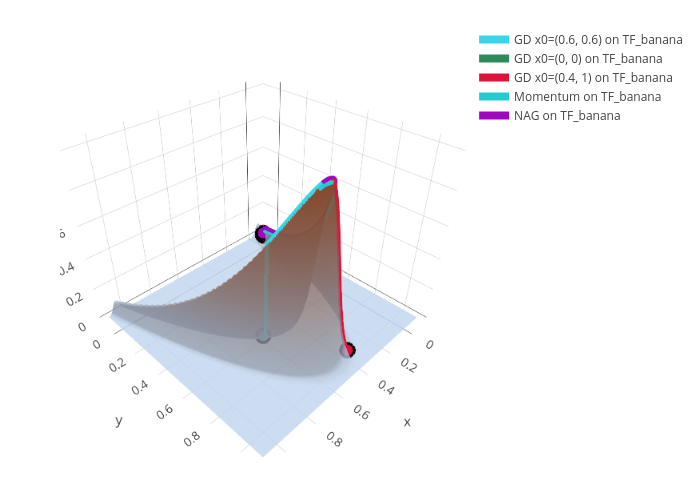

``` r
# Setting the scene and layout can be done with `$setScene()` and `setLayout()`:
viz$setScene(1, -2, 1)
viz$setLayout(legend = list(
  orientation = "h",   # show entries horizontally
  xanchor = "center",  # use center of legend as anchor
  x = 0.5))            # legend = list()
```

``` r
viz$plot()

# Save a plot can also easily be done with `save()`
viz$save("myfigure.png")
```

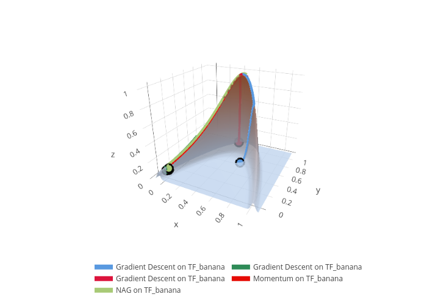

``` r
# Create animations with `$animate()` (Note: Just the frames are stored,
# you have to put them together by yourself):
viz$animate(nframes = 24L, view_start = list(x = 1, y = -2, z = 1),
  view_end = list(x = 0.5, y = -2, z = 1))
# Use, e.g., ImageMagick: `convert -delay 20 -loop 0 animation/*.png mygif.gif`
```


## Example: Linear Model loss and optimization

``` r
# Define the linear model loss function:
mylm = function(x, Xmat, y) {
  l2norm(Xmat %*% x - y)
}

# Use the iris dataset with response `Sepal.Width` and feature `Petal.Width`:
Xmat = model.matrix(~ Petal.Width, data = iris)
y = iris$Sepal.Width

# Create a new object:
obj_lm = Objective$new(id = "iris LM", fun = mylm, xdim = 2,  Xmat = Xmat, y = y, minimize = TRUE)

# Optimize with two different start points:
oo1 = OptimizerGD$new(obj_lm, x_start = c(0, -0.05), step_size = 0.001, print_trace = FALSE)
oo1$optimize(steps = 100)

tail(oo1$archive)
#>            x_out          x_in            update fval_out fval_in    lr
#> 1: 1.0466,0.9257 1.0381,0.9216 0.008494,0.004121    16.05   16.14 0.001
#> 2: 1.0550,0.9296 1.0466,0.9257 0.008415,0.003971    15.97   16.05 0.001
#> 3: 1.0633,0.9335 1.0550,0.9296 0.008336,0.003823    15.88   15.97 0.001
#> 4: 1.0716,0.9371 1.0633,0.9335 0.008258,0.003676    15.80   15.88 0.001
#> 5: 1.0798,0.9407 1.0716,0.9371   0.00818,0.00353    15.72   15.80 0.001
#> 6: 1.0879,0.9441 1.0798,0.9407 0.008103,0.003386    15.65   15.72 0.001
#>          objective momentum step batch
#> 1: <Objective[17]>        0   95     1
#> 2: <Objective[17]>        0   96     1
#> 3: <Objective[17]>        0   97     1
#> 4: <Objective[17]>        0   98     1
#> 5: <Objective[17]>        0   99     1
#> 6: <Objective[17]>        0  100     1

oo2 = OptimizerMomentum$new(obj_lm, x_start = c(-0.05, 0), step_size = 0.001, print_trace = FALSE)
oo2$optimize(steps = 100)

tail(oo2$archive)
#>              x_out            x_in                  update fval_out fval_in
#> 1:  3.3463,-0.2398  3.3417,-0.2393      0.004586,-0.000567    4.959   4.959
#> 2:  3.3504,-0.2399  3.3463,-0.2398  0.00408801,-0.00002542    4.960   4.959
#> 3:  3.3539,-0.2396  3.3504,-0.2399     0.0035171,0.0003152    4.960   4.960
#> 4:  3.3568,-0.2391  3.3539,-0.2396       0.002885,0.000475    4.961   4.960
#> 5:  3.3590,-0.2386  3.3568,-0.2391     0.0022125,0.0004852    4.962   4.961
#> 6:  3.3605,-0.2382  3.3590,-0.2386     0.0015226,0.0003845    4.963   4.962
#>       lr       objective momentum step batch
#> 1: 0.001 <Objective[17]>      0.9   95     1
#> 2: 0.001 <Objective[17]>      0.9   96     1
#> 3: 0.001 <Objective[17]>      0.9   97     1
#> 4: 0.001 <Objective[17]>      0.9   98     1
#> 5: 0.001 <Objective[17]>      0.9   99     1
#> 6: 0.001 <Objective[17]>      0.9  100     1

oo3 = OptimizerNAG$new(obj_lm, x_start = c(0, 0), step_size = 0.001, print_trace = FALSE)
oo3$optimize(steps = 100)

tail(oo3$archive)
#>              x_out            x_in                update fval_out fval_in    lr
#> 1:  3.3395,-0.2304  3.3366,-0.2287    0.002835,-0.001660    4.955   4.955 0.001
#> 2:  3.3418,-0.2317  3.3395,-0.2304    0.002351,-0.001342    4.956   4.955 0.001
#> 3:  3.3437,-0.2328  3.3418,-0.2317    0.001895,-0.001061    4.957   4.956 0.001
#> 4:  3.3452,-0.2336  3.3437,-0.2328  0.0014699,-0.0008125    4.957   4.957 0.001
#> 5:  3.3463,-0.2342  3.3452,-0.2336  0.0010754,-0.0005926    4.957   4.957 0.001
#> 6:  3.3470,-0.2346  3.3463,-0.2342  0.0007129,-0.0003968    4.958   4.957 0.001
#>          objective momentum step batch
#> 1: <Objective[17]>      0.9   95     1
#> 2: <Objective[17]>      0.9   96     1
#> 3: <Objective[17]>      0.9   97     1
#> 4: <Objective[17]>      0.9   98     1
#> 5: <Objective[17]>      0.9   99     1
#> 6: <Objective[17]>      0.9  100     1

# Visualize, this time with contour lines and custom limits:
viz = Visualizer$new(obj_lm, x1limits = c(-0.5, 5), x2limits = c(-3.2, 2.8))

viz$initLayerContour()

viz$addLayerOptimizationTrace(oo1, add_marker_at = round(seq(1, 100, len = 10L)))
viz$addLayerOptimizationTrace(oo2, add_marker_at = c(1, 50, 90), marker_shape = c("square", "star-triangle-down", "cross"))
viz$addLayerOptimizationTrace(oo3, add_marker_at = 100, marker_shape = "star")

viz$setLayout(legend = list(orientation = "h", xanchor = "center", x = 0.5))
```

``` r
viz$plot()

viz$animate(nframes = 24L)
# Use, e.g., ImageMagick: `convert -delay 10 -loop 0 animation/*.png mygif.gif`
```

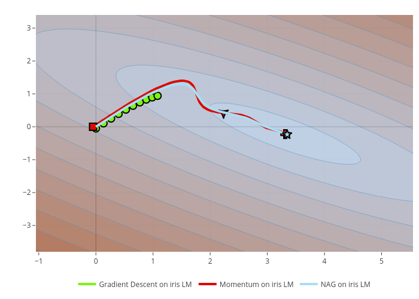 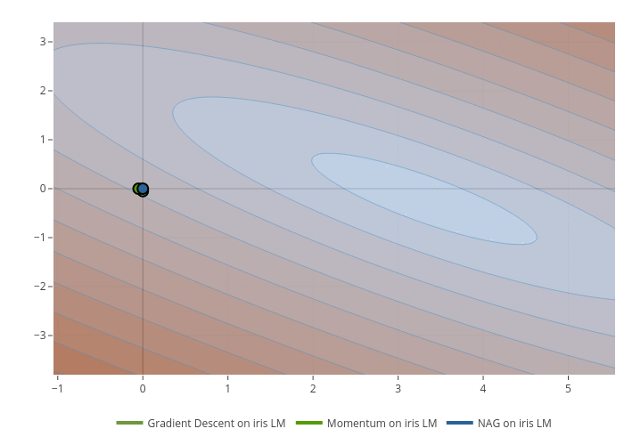

## All 2D Objectives

#### GoldsteinPrice

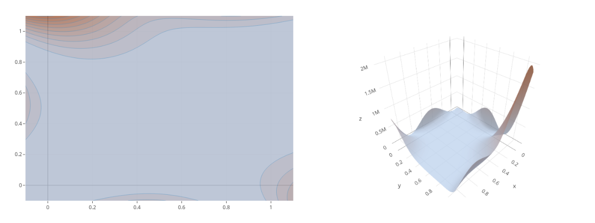

#### GoldsteinPriceLog

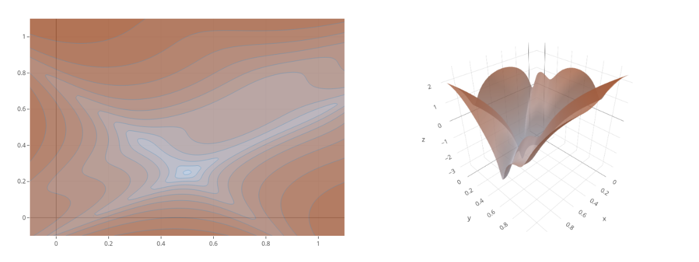

#### ackley

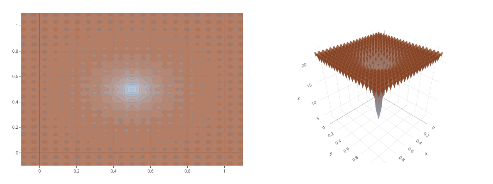

#### banana


#### beale

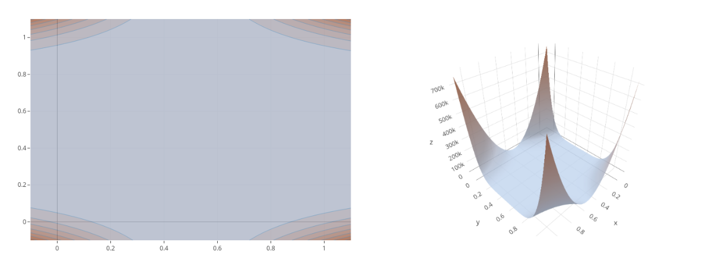

#### borehole


#### branin

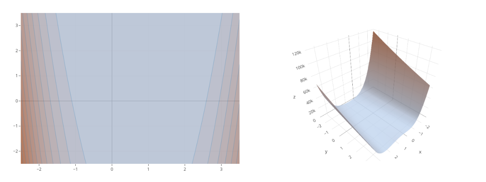

#### currin1991

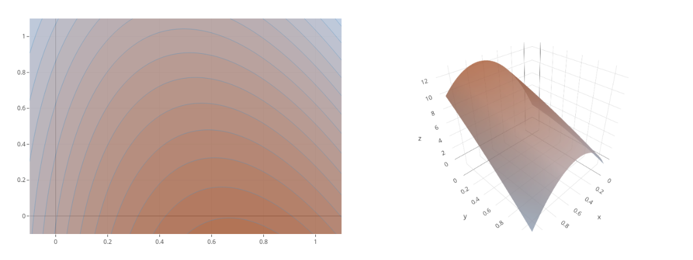

#### easom

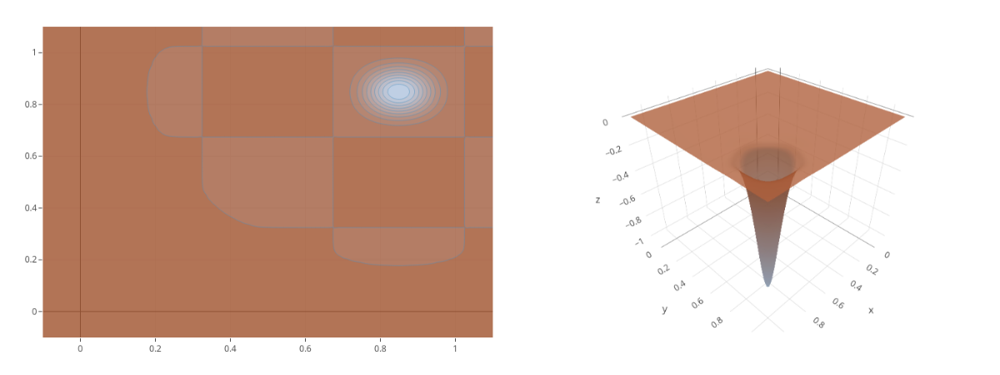

#### franke


#### hump

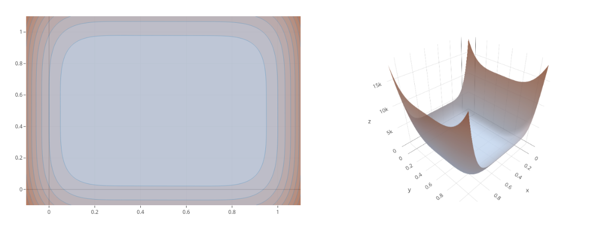

#### lim2002

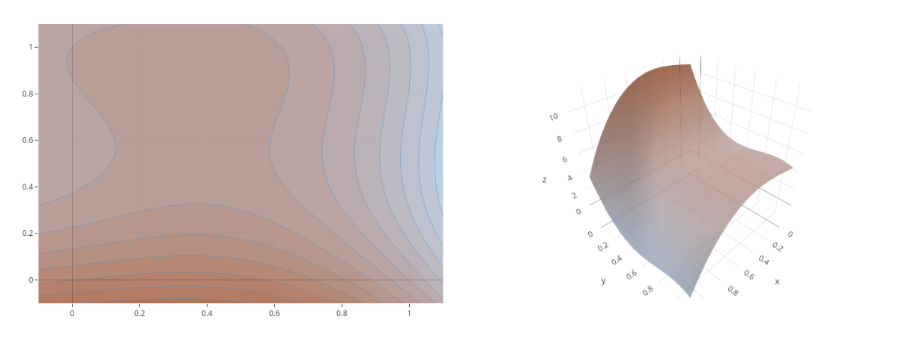

#### quad_peaks

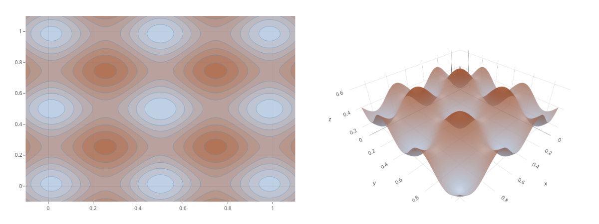

#### quad_peaks_slant

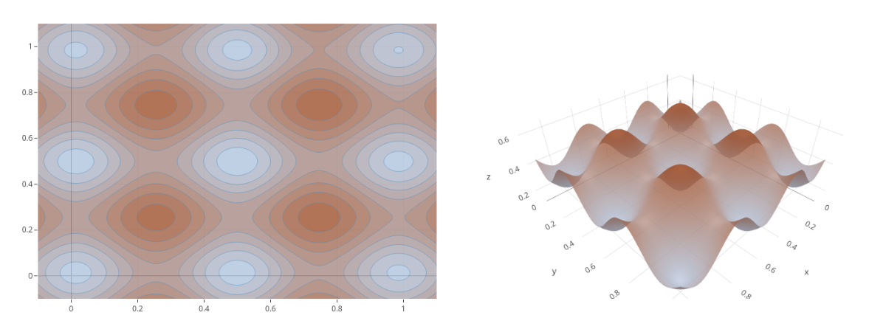

#### sinumoid


#### waterfall


#### zhou1998

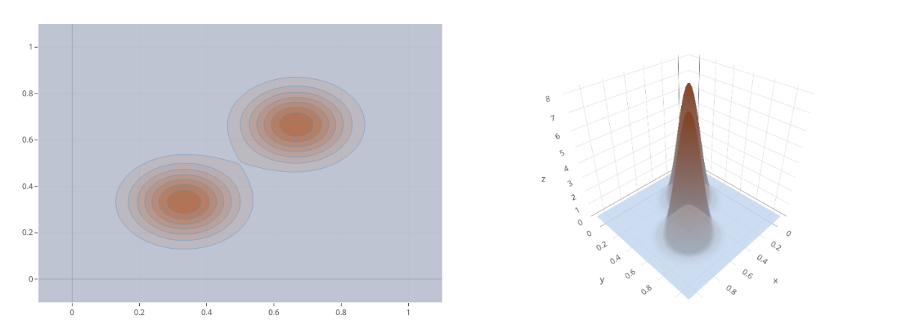
