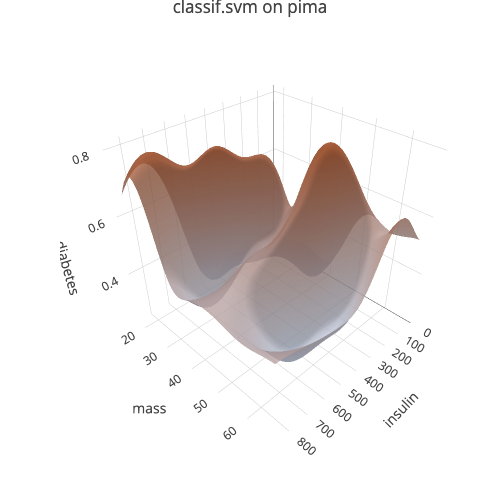

<!-- README.md is generated from README.Rmd. Please edit that file -->

# vistool

<!-- badges: start -->

[](https://github.com/slds-lmu/vistool/actions/workflows/r-cmd-check.yaml)
<!-- badges: end -->

The goal of `vistool` is to visualize optimization tracing and generally
aid in teaching optimization-related concepts.

## Installation

You can install the development version of vistool from
[GitHub](https://github.com/) with:

``` r
# install.packages("pak")
pak::pak("slds-lmu/vistool")
```

Please note that visualization features rely on [`plotly`]() which in
turns relies on certain functionality provided by Python packages, which
are accessed via reticulate.  
Most importantly this affects the `$save()` functionality for plots,
which uses `plotly::save_image()` internally, and requires the `kaleido`
Python package.

The following instructions are provided by `?plotly::save_image` and
assume you do not have `miniconda` installed already:

``` r
install.packages('reticulate')
reticulate::install_miniconda()
reticulate::conda_install('r-reticulate', 'python-kaleido')
reticulate::conda_install('r-reticulate', 'plotly', channel = 'plotly')
reticulate::use_miniconda('r-reticulate')
```

## Example

``` r
library(vistool)
library(mlr3verse)
#> Loading required package: mlr3
```

This examples shows how to visualize the prediction surface of an SVM on
the `pima` task included in `mlr3`:

``` r
# Create an example task, add missing data imputation and select 2 features
task = tsk("pima")
task = po("imputemean")$train(list(task))[[1]]
task$select(c("insulin", "mass"))

# Select example learner
learner = lrn("classif.svm", predict_type = "prob")

# Create the Visualizer object from task and learner
vis = as_visualizer(task, learner)

# Define a 3D scene
vis$set_scene(x = 1.4, y = 1.4, z = 1.4)
```

View interactively:

``` r
vis$plot()
```



Save static version as png:

``` r
vis$save("man/figures/demo_1.png", width = 500, height = 500)
```

## Resources

For visualization of…

- [Loss
  Functions](https://slds-lmu.github.io/vistool/articles/loss_functions.html)
- [Model
  Predictions](https://slds-lmu.github.io/vistool/articles/model.html)
- [Objective
  Functions](https://slds-lmu.github.io/vistool/articles/objective.html)
