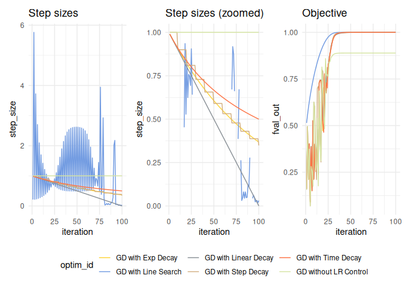
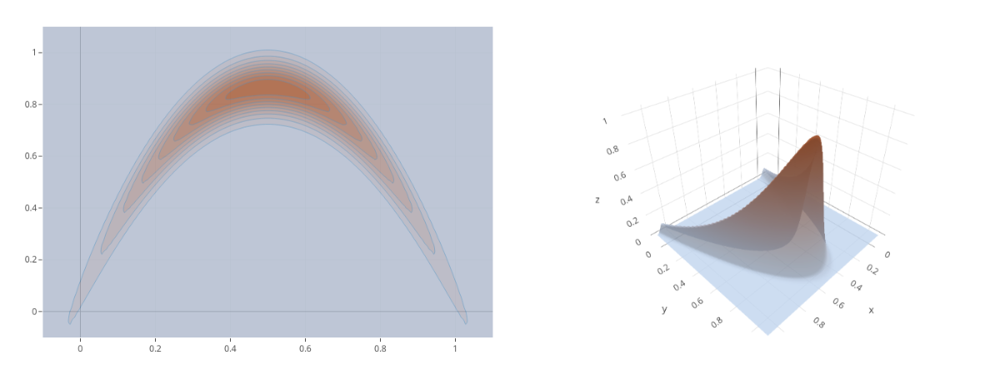
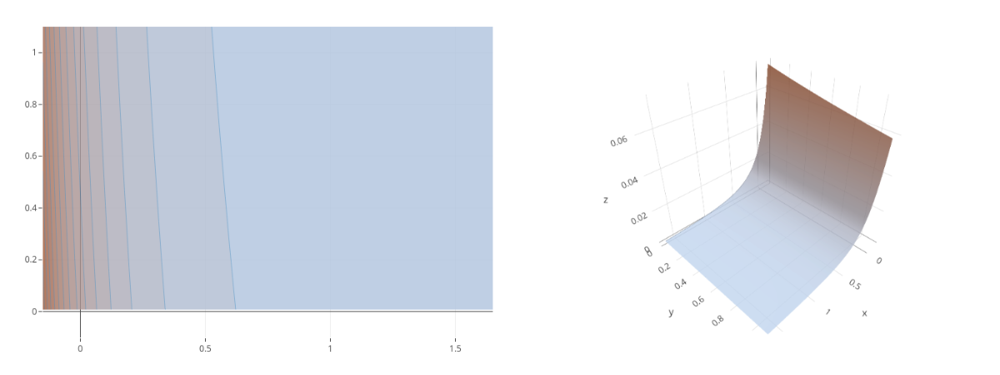
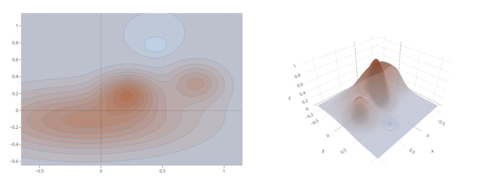
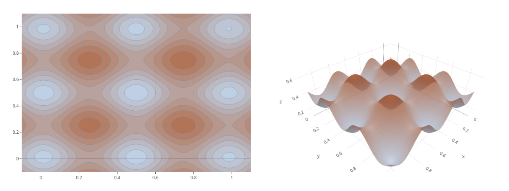
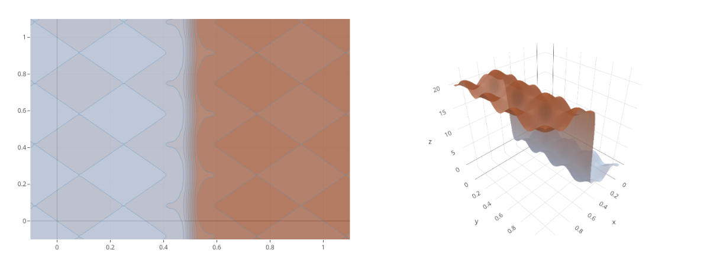
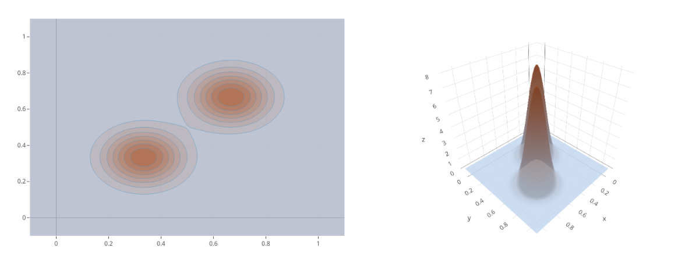

Vistool
================

- <a href="#how-to-use" id="toc-how-to-use">How to use</a>
- <a href="#objective" id="toc-objective">Objective</a>
  - <a href="#dictionary" id="toc-dictionary">Dictionary</a>
  - <a href="#objective-class" id="toc-objective-class">Objective class</a>
  - <a href="#visualizing-the-objective"
    id="toc-visualizing-the-objective">Visualizing the objective:</a>
  - <a href="#custom-objectives" id="toc-custom-objectives">Custom
    objectives</a>
- <a href="#optimizer" id="toc-optimizer">Optimizer</a>
  - <a href="#optimizer-class" id="toc-optimizer-class">Optimizer class</a>
  - <a href="#visualize-optimization-traces"
    id="toc-visualize-optimization-traces">Visualize optimization traces</a>
  - <a href="#step-size-control" id="toc-step-size-control">Step size
    control</a>
- <a href="#visualizer" id="toc-visualizer">Visualizer</a>
  - <a href="#visualizer-class" id="toc-visualizer-class">Visualizer
    class</a>
  - <a href="#initial-layers" id="toc-initial-layers">Initial layers</a>
  - <a href="#optimization-traces" id="toc-optimization-traces">Optimization
    traces</a>
  - <a href="#setting-the-layout-and-scene-todo"
    id="toc-setting-the-layout-and-scene-todo">Setting the layout and scene
    (TODO)</a>
  - <a href="#overlaying-layers-todo"
    id="toc-overlaying-layers-todo">Overlaying layers (TODO)</a>
  - <a href="#manual-layers-todo" id="toc-manual-layers-todo">Manual layers
    (TODO)</a>
  - <a href="#animations-todo" id="toc-animations-todo">Animations
    (TODO)</a>
- <a href="#all-2d-objectives" id="toc-all-2d-objectives">All 2D
  Objectives</a>

<!-- README.md is generated from README.Rmd. Please edit that file -->

# How to use

Just load the package with `devtools::load_all()`. Or install with
`remotes::install_github("slds-lmu/vistool", ref = "main")` for a
permanent installation.

``` r
devtools::load_all()
#> ℹ Loading vistool
#> Loading required package: R6
#> 
#> Loading required package: rootSolve
#> 
#> Loading required package: checkmate
#> 
#> Loading required package: data.table
#> 
#> data.table 1.14.6 using 4 threads (see ?getDTthreads).  Latest news: r-datatable.com
#> 
#> Loading required package: colorspace
#> 
#> Loading required package: mlr3misc
#> 
#> Loading required package: TestFunctions
#> 
#> Loading required package: plotly
#> 
#> Loading required package: ggplot2
#> 
#> 
#> Attaching package: 'plotly'
#> 
#> 
#> The following object is masked from 'package:ggplot2':
#> 
#>     last_plot
#> 
#> 
#> The following object is masked from 'package:stats':
#> 
#>     filter
#> 
#> 
#> The following object is masked from 'package:graphics':
#> 
#>     layout
#> 
#> 
#> Loading required package: stringr
#> 
#> 
#> Attaching package: 'stringr'
#> 
#> 
#> The following object is masked from 'package:mlr3misc':
#> 
#>     str_trunc
```

# Objective

## Dictionary

``` r
as.data.table(tfun_dict)
#>                        key               label xdim limits_lower limits_upper
#>  1:           TF_Gfunction           Gfunction   NA           NA           NA
#>  2:      TF_GoldsteinPrice      GoldsteinPrice    2          0,0          1,1
#>  3:   TF_GoldsteinPriceLog   GoldsteinPriceLog    2          0,0          1,1
#>  4:         TF_OTL_Circuit         OTL_Circuit    6           NA           NA
#>  5:          TF_RoosArnold          RoosArnold   NA           NA           NA
#>  6:              TF_ackley              ackley    2          0,0          1,1
#>  7:              TF_banana              banana    2          0,0          1,1
#>  8:               TF_beale               beale    2          0,0          1,1
#>  9:            TF_borehole            borehole    2          0,0      1.5,1.0
#> 10:              TF_branin              branin    2        -2,-2          3,3
#> 11:          TF_currin1991          currin1991    2          0,0          1,1
#> 12:               TF_easom               easom    2          0,0          1,1
#> 13:              TF_franke              franke    2    -0.5,-0.5          1,1
#> 14:           TF_gaussian1           gaussian1   NA           NA           NA
#> 15:            TF_griewank            griewank   NA           NA           NA
#> 16:            TF_hartmann            hartmann    6           NA           NA
#> 17:                TF_hump                hump    2          0,0          1,1
#> 18:                TF_levy                levy   NA           NA           NA
#> 19:             TF_lim2002             lim2002    2          0,0          1,1
#> 20: TF_linkletter_nosignal linkletter_nosignal   NA           NA           NA
#> 21:         TF_michalewicz         michalewicz   NA           NA           NA
#> 22:              TF_piston              piston    7           NA           NA
#> 23:              TF_powsin              powsin   NA           NA           NA
#> 24:          TF_quad_peaks          quad_peaks    2          0,0          1,1
#> 25:    TF_quad_peaks_slant    quad_peaks_slant    2          0,0          1,1
#> 26:           TF_rastrigin           rastrigin   NA           NA           NA
#> 27:            TF_robotarm            robotarm    8           NA           NA
#> 28:            TF_sinumoid            sinumoid    2          0,0          1,1
#> 29:             TF_sqrtsin             sqrtsin   NA           NA           NA
#> 30:           TF_waterfall           waterfall    2          0,0          1,1
#> 31:          TF_wingweight          wingweight   10           NA           NA
#> 32:            TF_zhou1998            zhou1998    2          0,0          1,1
#>                        key               label xdim limits_lower limits_upper
```

## Objective class

``` r
# Get an objective:
obj = tfun_dict$get("TF_branin")

# Evaluate the objective at point x:
x = c(0.9, 1)
obj$eval(x)
#> [1] 178.3

# Use `$evalStore()` to add the evaluated point, function value, and further information
# into the objectives archive:
obj$archive
#> Null data.table (0 rows and 0 cols)
obj$evalStore(x)
obj$archive
#>          x  fval          grad gnorm
#> 1: 0.9,1.0 178.3 -354.3, 395.8 531.3

# The gradient and Hessian at point x can be extracted by:
obj$grad(x)
#> [1] -354.3  395.8
obj$hess(x)
#>         [,1]   [,2]
#> [1,] -1989.5 -284.2
#> [2,]  -284.2 2162.1
```

## Visualizing the objective:

For now, visualizing objectives is just possible for 2-dimensional
functions. The `Visualizer` class automatically does all the
visualization stuff for you:

``` r
viz = Visualizer$new(obj)
```

For now, just the objective is defined but no graphical layers. The
basic layer for 2d functions are contour lines and a 3d surface plot:

``` r
# Contour:
viz$initLayerContour()
viz$plot()
```


``` r
# Surface:
viz$initLayerSurface()
viz$plot()
```


## Custom objectives

Let’s define a loss for a linear model on the iris data with target
`Sepal.Width` and feature `Petal.Width`. First, an `Objective` requires
a function for evaluation:

``` r
# Define the linear model loss function as SSE:
mylm = function(x, Xmat, y) {
  l2norm(y - Xmat %*% x)
}
```

To fix the loss for the data, the `Ojbective$new()` call allows to pass
custom arguments that are stored and reused in every call to `$eval()`
to evaluate `fun`. So, calling `$eval(x)` internally calls
`fun(x, ...)`. These arguments must be specified just once:

``` r
# Use the iris dataset with response `Sepal.Width` and feature `Petal.Width`:
Xmat = model.matrix(~ Petal.Width, data = iris)
y = iris$Sepal.Width

# Create a new object:
obj_lm = Objective$new(id = "iris LM", fun = mylm, xdim = 2,  Xmat = Xmat, y = y, minimize = TRUE)

obj_lm$evalStore(c(1, 2))
obj_lm$evalStore(c(2, 3))
obj_lm$evalStore(coef(lm(Sepal.Width ~ Petal.Width, data = iris)))

obj_lm$archive
#>                  x   fval                grad     gnorm
#> 1:             1,2 21.554        2.375,11.723 1.196e+01
#> 2:             2,3 43.410        8.779,16.929 1.907e+01
#> 3:  3.3084,-0.2094  4.951 4.564e-07,2.665e-07 5.285e-07
```

# Optimizer

## Optimizer class

The optimizer class defines the optimization strategy and is initialized
by taking an objective function, start value, and learning rate.
Available optimizer are:

- Gradient descent with `OptimizerGD`
- Momentum with `OptimizerMomentum`
- Nesterovs momentum with `OptimizerNAG`

Creating an optimizer is done by (let’s use an x value that works well):

``` r
obj = tfun_dict$get("TF_banana")
opt = OptimizerGD$new(obj, x_start = c(0.8, 0.6), lr = 0.01)
```

With these value set, optimization is done by calling `$optimize()` with
the number of steps as argument:

``` r
opt$optimize(10L)
#> TF_banana: Batch 1 step 1: f(x) = 0.1572, x = c(0.7352, 0.5778)
#> TF_banana: Batch 1 step 2: f(x) = 0.4955, x = c(0.7888, 0.6174)
#> TF_banana: Batch 1 step 3: f(x) = 0.2118, x = c(0.7296, 0.5977)
#> TF_banana: Batch 1 step 4: f(x) = 0.3741, x = c(0.792, 0.6455)
#> TF_banana: Batch 1 step 5: f(x) = 0.069, x = c(0.6932, 0.602)
#> TF_banana: Batch 1 step 6: f(x) = 0.2809, x = c(0.7189, 0.6245)
#> TF_banana: Batch 1 step 7: f(x) = 0.2565, x = c(0.7877, 0.6806)
#> TF_banana: Batch 1 step 8: f(x) = 0.1753, x = c(0.6922, 0.6351)
#> TF_banana: Batch 1 step 9: f(x) = 0.6265, x = c(0.7418, 0.6799)
#> TF_banana: Batch 1 step 10: f(x) = 0.5908, x = c(0.717, 0.6795)
```

Calling `$optimize()` also writes into the archive of the optimizer and
also calls `$evalStore()` of the objective. Therefore, `$optimize()`
writes into two archives:

``` r
opt$archive
#>             x_out          x_in                update fval_out fval_in   lr
#>  1: 0.7352,0.5778       0.8,0.6     -0.06482,-0.02220  0.15717 0.46246 0.01
#>  2: 0.7888,0.6174 0.7352,0.5778       0.05363,0.03956  0.49548 0.15717 0.01
#>  3: 0.7296,0.5977 0.7888,0.6174     -0.05920,-0.01964  0.21180 0.49548 0.01
#>  4: 0.7920,0.6455 0.7296,0.5977       0.06241,0.04777  0.37414 0.21180 0.01
#>  5: 0.6932,0.6020 0.7920,0.6455     -0.09885,-0.04354  0.06901 0.37414 0.01
#>  6: 0.7189,0.6245 0.6932,0.6020       0.02576,0.02256  0.28086 0.06901 0.01
#>  7: 0.7877,0.6806 0.7189,0.6245       0.06876,0.05609  0.25645 0.28086 0.01
#>  8: 0.6922,0.6351 0.7877,0.6806     -0.09553,-0.04547  0.17532 0.25645 0.01
#>  9: 0.7418,0.6799 0.6922,0.6351       0.04961,0.04472  0.62648 0.17532 0.01
#> 10: 0.7170,0.6795 0.7418,0.6799 -0.0247595,-0.0003393  0.59084 0.62648 0.01
#>     step_size       objective momentum step batch
#>  1:         1 <Objective[18]>        0    1     1
#>  2:         1 <Objective[18]>        0    2     1
#>  3:         1 <Objective[18]>        0    3     1
#>  4:         1 <Objective[18]>        0    4     1
#>  5:         1 <Objective[18]>        0    5     1
#>  6:         1 <Objective[18]>        0    6     1
#>  7:         1 <Objective[18]>        0    7     1
#>  8:         1 <Objective[18]>        0    8     1
#>  9:         1 <Objective[18]>        0    9     1
#> 10:         1 <Objective[18]>        0   10     1
opt$objective$archive
#>                 x    fval              grad  gnorm
#>  1:       0.8,0.6 0.46246     -6.482,-2.220  6.851
#>  2: 0.7352,0.5778 0.15717       5.363,3.956  6.664
#>  3: 0.7888,0.6174 0.49548     -5.920,-1.964  6.238
#>  4: 0.7296,0.5977 0.21180       6.241,4.777  7.860
#>  5: 0.7920,0.6455 0.37414     -9.885,-4.354 10.801
#>  6: 0.6932,0.6020 0.06901       2.576,2.256  3.424
#>  7: 0.7189,0.6245 0.28086       6.876,5.609  8.874
#>  8: 0.7877,0.6806 0.25645     -9.553,-4.547 10.580
#>  9: 0.6922,0.6351 0.17532       4.961,4.472  6.679
#> 10: 0.7418,0.6799 0.62648 -2.47595,-0.03393  2.476
```

We can let the algorithm run for another 10 iterations in a second
batch:

``` r
opt$optimize(10L)
#> TF_banana: Batch 2 step 1: f(x) = 0.2592, x = c(0.7638, 0.728)
#> TF_banana: Batch 2 step 2: f(x) = 0.2873, x = c(0.6702, 0.679)
#> TF_banana: Batch 2 step 3: f(x) = 0.5391, x = c(0.7292, 0.7404)
#> TF_banana: Batch 2 step 4: f(x) = 0.1765, x = c(0.6349, 0.6896)
#> TF_banana: Batch 2 step 5: f(x) = 0.6858, x = c(0.6718, 0.7368)
#> TF_banana: Batch 2 step 6: f(x) = 0.401, x = c(0.713, 0.7914)
#> TF_banana: Batch 2 step 7: f(x) = 0.3109, x = c(0.6133, 0.7283)
#> TF_banana: Batch 2 step 8: f(x) = 0.8142, x = c(0.657, 0.7963)
#> TF_banana: Batch 2 step 9: f(x) = 0.7474, x = c(0.6208, 0.7806)
#> TF_banana: Batch 2 step 10: f(x) = 0.5501, x = c(0.6575, 0.8468)
```

Still not very satisfying.

## Visualize optimization traces

A layer of the `Visualizer` class is `$addLayerOptimizationTrace()` that
gets the optimizer as argument and adds the optimization trace to the
plot:

``` r
viz = Visualizer$new(obj)
viz$initLayerContour()
viz$addLayerOptimizationTrace(opt)
viz$plot()
```


## Step size control

When calling `$optimize()`, the second argument is `stepSizeControl`
that allows to expand or compress the update added to the old value of
.
E.g., for GD with
")
the update
")
is multiplied with the return value of `stepSizeControl()`. There are a
few pre-implemented control functions like line search or various
decaying methods:

- `stepSizeControlLineSearch(lower, upper)`: Conduct a line search for
  
  in
  ")\`.
- `stepSizeControlDecayTime(decay)`: Lower the updates by
  ^{-1}").
- `stepSizeControlDecayExp(decay)`: Lower the updates by
  ").
- `stepSizeControlDecayLinear(iter_zero)`: Lower the updates until
  `iter_zero` is reached. Updates with `iter > iter_zero` are 0.
- `stepSizeControlDecaySteps(drop_rate, every_iter)`: Lower the updates
  `every_iter` by `drop_rate`.

Note that these functions return a function that contains a function
with the required signature:

``` r
stepSizeControlDecayTime()
#> function(x, u, obj, opt) {
#>     assertStepSizeControl(x, u, obj, opt)
#> 
#>     epoch = nrow(obj$archive)
#>     return(1 / (1 + decay * epoch))
#>   }
#> <environment: 0x55db2be863a0>
```

Let’s define multiple gradient descent optimizers and optimize 100 steps
with a step size control:

``` r
x0 = c(0.8, 0.6)
lr = 0.01
obj = tfun_dict$get("TF_banana")

oo1 = OptimizerGD$new(obj, x_start = x0, lr = lr, id = "GD without LR Control", print_trace = FALSE)
oo2 = OptimizerGD$new(obj, x_start = x0, lr = lr, id = "GD with Line Search", print_trace = FALSE)
oo3 = OptimizerGD$new(obj, x_start = x0, lr = lr, id = "GD with Time Decay", print_trace = FALSE)
oo4 = OptimizerGD$new(obj, x_start = x0, lr = lr, id = "GD with Exp Decay", print_trace = FALSE)
oo5 = OptimizerGD$new(obj, x_start = x0, lr = lr, id = "GD with Linear Decay", print_trace = FALSE)
oo6 = OptimizerGD$new(obj, x_start = x0, lr = lr, id = "GD with Step Decay", print_trace = FALSE)

oo1$optimize(steps = 100)
oo2$optimize(steps = 100, stepSizeControlLineSearch())
oo3$optimize(steps = 100, stepSizeControlDecayTime())
oo4$optimize(steps = 100, stepSizeControlDecayExp())
oo5$optimize(steps = 100, stepSizeControlDecayLinear())
oo6$optimize(steps = 100, stepSizeControlDecaySteps())
```

For now we don’t know how well it worked. Let’s collect all archives
with `mergeOptimArchives()` and visualize the step sizes and function
values with `patchwork` magic:

``` r
arx = mergeOptimArchives(oo1, oo2, oo3, oo4, oo5, oo6)

library(patchwork)
gg1 = ggplot(arx, aes(x = iteration, y = step_size, color = optim_id))
gg2 = ggplot(arx, aes(x = iteration, y = fval_out, color = optim_id))

(gg1 + ggtitle("Step sizes") |
 gg1 + ylim(0, 1) + ggtitle("Step sizes (zoomed)") |
 gg2 + ggtitle("Objective")) +
  plot_layout(guides = "collect") &
  geom_line() &
  theme_minimal() &
  theme(legend.position = "bottom") &
  ggsci::scale_color_simpsons()
```

<!-- -->

Visualizing the traces is done as before by adding optimization trace
layer. We can do this for all optimizers to add multiple traces to the
plot (colors are picked randomly, see the [`Visualizer`](#visualizer)
section for more details about plotting):

``` r
viz = Visualizer$new(obj)
viz$initLayerContour()

viz$addLayerOptimizationTrace(oo1)
viz$addLayerOptimizationTrace(oo2)
viz$addLayerOptimizationTrace(oo3)
viz$addLayerOptimizationTrace(oo4)
viz$addLayerOptimizationTrace(oo5)
viz$addLayerOptimizationTrace(oo6)

viz$plot()
```


Practically, it should be no issue to also combine multiple control
functions. The important thing is to keep the signature of the function
by allowing the function to get the arguments `x` (current value), `u`
(current update), `obj` (`Objective` object), and `opt` (`Optimizer`
object):

``` r
myStepSizeControl = function(x, u, obj, opt) {
  sc1 = stepSizeControlLineSearch(0, 10)
  sc2 = stepSizeControlDecayTime(0.1)
  return(sc1(x, u, obj, opt) * sc2(x, u, obj, opt))
}

my_oo = OptimizerGD$new(obj, x_start = x0, lr = lr, id = "GD without LR Control", print_trace = FALSE)
my_oo$optimize(100, myStepSizeControl)
tail(my_oo$archive)
#>            x_out          x_in                update fval_out fval_in   lr
#> 1: 0.5000,0.8667 0.5000,0.8667   -5.17e-07, 1.11e-10        1       1 0.01
#> 2: 0.5000,0.8667 0.5000,0.8667 -4.678e-07, 0.000e+00        1       1 0.01
#> 3: 0.5000,0.8667 0.5000,0.8667 -4.239e-07,-1.110e-10        1       1 0.01
#> 4: 0.5000,0.8667 0.5000,0.8667 -3.844e-07, 1.110e-10        1       1 0.01
#> 5: 0.5000,0.8667 0.5000,0.8667 -3.487e-07, 0.000e+00        1       1 0.01
#> 6: 0.5000,0.8667 0.5000,0.8667 -3.169e-07, 0.000e+00        1       1 0.01
#>    step_size       objective momentum step batch
#> 1:    0.5943 <Objective[18]>        0   95     1
#> 2:    0.5889 <Objective[18]>        0   96     1
#> 3:    0.5829 <Objective[18]>        0   97     1
#> 4:    0.5774 <Objective[18]>        0   98     1
#> 5:    0.5722 <Objective[18]>        0   99     1
#> 6:    0.5668 <Objective[18]>        0  100     1
```

# Visualizer

## Visualizer class

Atm, just 2 dimensional inputs are supported. The `Visualizer` class is
initialized by calling `Visualizer$new(obj)` for a given `Objective`.
Furhter arguments are `x1limits` and `x2limits` as well as `padding` to
stretch the limits by a factor and `npoints` to specify the number of
generated point per dimension, hence `npoints^2` points are evaluated to
create the initial layers.

## Initial layers

An initial layer is always required to which other layers (such as
optimization traces) are added step by step. The two available base
layers are contour lines `$initLayerContour()` and
`$initLayerSurface()`.

For both, the first argument tis the opacity and the second a
colorscale:

``` r
viz = Visualizer$new(tfun_dict$get("TF_franke"))
viz$initLayerContour(opacity = 1, colorscale = list(c(0, 1), c("rgb(176,196,222)", "rgb(160,82,45)")))
viz$plot()
```


``` r
viz = Visualizer$new(tfun_dict$get("TF_franke"))
viz$initLayerContour(colorscale = list(c(0, 1), c("white", "blue")))
viz$plot()
```


``` r
viz = Visualizer$new(tfun_dict$get("TF_franke"))
viz$initLayerSurface(opacity = 1, colorscale = list(c(0, 1), c("white", "black")))
viz$plot()
```


Internally, `add_trace()` from `plotly` is called. Further arguments are
directly passed to it, e.g. by adding contour lines:

``` r
viz = Visualizer$new(tfun_dict$get("TF_franke"))

# Add 10 grid lines per dim, limits (sometimes) can be obtained form the
# objective:
llower = viz$objective$limits_lower
lupper = viz$objective$limits_upper
ssize = (lupper - llower) / 10

viz$initLayerSurface(opacity = 1, colorscale = list(c(0, 1), c("white", "black")),
  contours = list(
    x = list(show = TRUE, start = llower[1], end = lupper[1], size = ssize[1], color = "black"),
    y = list(show = TRUE, start = llower[2], end = lupper[2], size = ssize[2], color = "black")))
viz$plot()
```


## Optimization traces

As shown previously, optimization traces can be added by
`$addLayerOptimizationTrace`. Let’s optimize our custom linear model
objective for the three available optimizers:

``` r
# Reset the archive to have an empty objective:
obj_lm$clearArchive()

oo1 = OptimizerGD$new(obj_lm, x_start = c(0, -0.05), lr = 0.001, print_trace = FALSE)
oo2 = OptimizerMomentum$new(obj_lm, x_start = c(-0.05, 0), lr = 0.001, print_trace = FALSE)
oo3 = OptimizerNAG$new(obj_lm, x_start = c(0, 0), lr = 0.001, print_trace = FALSE)

oo1$optimize(steps = 100)
oo2$optimize(steps = 100)
oo3$optimize(steps = 100)
```

``` r
viz = Visualizer$new(obj_lm, x1limits = c(-0.5, 5), x2limits = c(-3.2, 2.8))

viz$initLayerContour()

viz$addLayerOptimizationTrace(oo1, add_marker_at = round(seq(1, 100, len = 10L)))
viz$addLayerOptimizationTrace(oo2, add_marker_at = c(1, 50, 90), marker_shape = c("square", "star-triangle-down", "cross"))
viz$addLayerOptimizationTrace(oo3, add_marker_at = 100, marker_shape = "star")

viz$plot()
```


## Setting the layout and scene (TODO)

``` r

viz$setLayout(legend = list(orientation = "h", xanchor = "center", x = 0.5))
```

## Overlaying layers (TODO)

``` r
obj = tfun_dict$get("TF_banana")
viz = Visualizer$new(obj)
viz$initLayerSurface()

x0 = c(0.85, 0.47)
viz$addLayerTaylor(x0, npoints_per_dim = 5, degree = 1, x1margin = 0.3, x2margin = 0.3, contours = list(
    x = list(show = TRUE, start = 0, end = 1, size = 0.03, color = "black"),
    y = list(show = TRUE, start = 0, end = 1, size = 0.03, color = "black")))
viz$addLayerHessian(x0)
viz$plot()
```


## Manual layers (TODO)

``` r
obj = tfun_dict$get("TF_banana")
viz = Visualizer$new(obj)
viz$initLayerSurface(opacity = 0.5)
p = viz$plot()
class(p)
#> [1] "plotly"     "htmlwidget"

nsim = 100
grid = data.frame(x = runif(nsim), y = runif(nsim))
grid$z = apply(grid, 1, viz$objective$eval) + rnorm(nsim, sd = 0.05)
p = p %>% add_trace(data = grid, x = ~x, y = ~y, z = ~z, mode = "markers",
  type = "scatter3d", marker = list(symbol = "cross"))

# Save with orca:
orca(p, "README_files/viz_scatter.png")
#> Warning: 'orca' is deprecated.
#> Use 'kaleido' instead.
#> See help("Deprecated")
#> -
#> (orca:112398): Gtk-WARNING **: 23:45:11.012: Theme parsing error: gtk-contained.css:2871:228: Missing closing bracket for :not()
#> \|/Fontconfig warning: "/usr/share/fontconfig/conf.avail/05-reset-dirs-sample.conf", line 6: unknown element "reset-dirs"
#> -\|/[112436:0216/234512.080193:ERROR:buffer_manager.cc(488)] [.DisplayCompositor]GL ERROR :GL_INVALID_OPERATION : glBufferData: <- error from previous GL command
#> -\|/-\|/-\|/- 

# List of marker symbols:
head(schema(F)$traces$scatter3d$attributes$marker$symbol$values)
#> [1] "circle"       "circle-open"  "cross"        "diamond"      "diamond-open"
#> [6] "square"
```


## Animations (TODO)

 

# All 2D Objectives

**GoldsteinPrice** 

**GoldsteinPriceLog** 

**ackley** 

**banana** 

**beale** 

**borehole** 

**branin** 

**currin1991** 

**easom** 

**franke** 

**hump** 

**lim2002** 

**quad_peaks** 

**quad_peaks_slant** 

**sinumoid** 

**waterfall** 

**zhou1998** 
