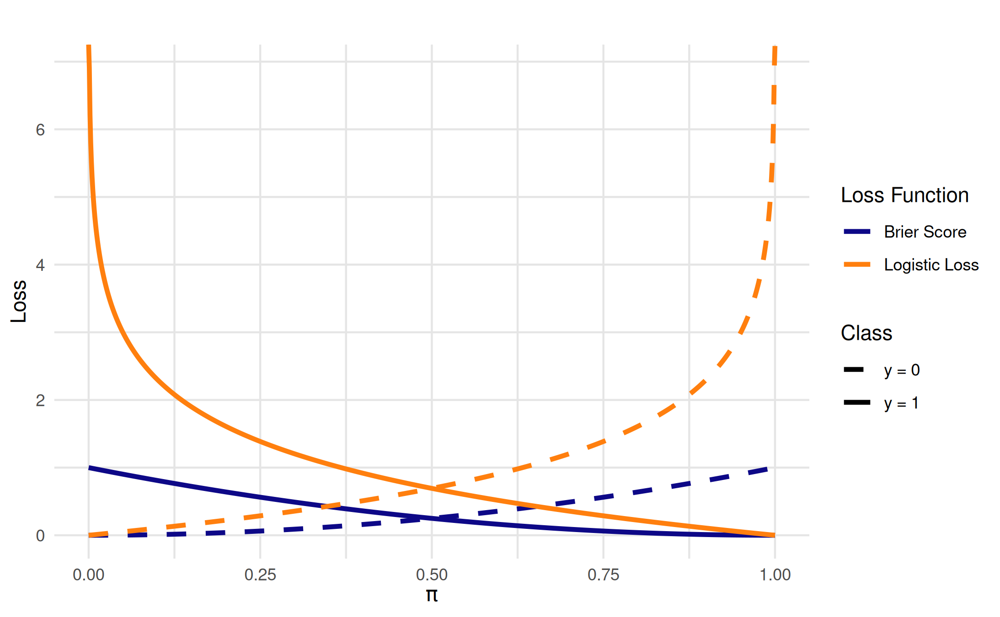
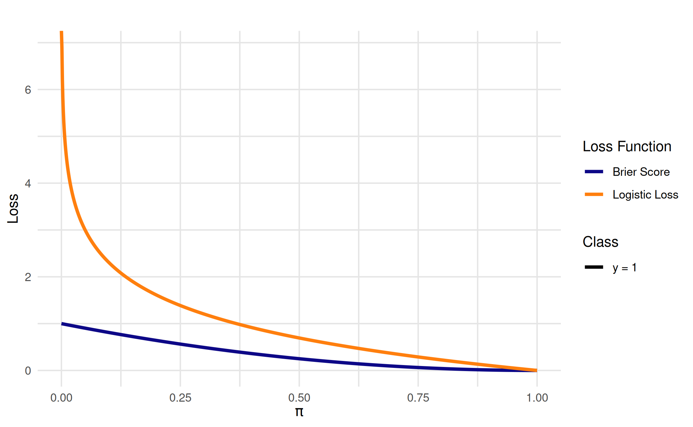
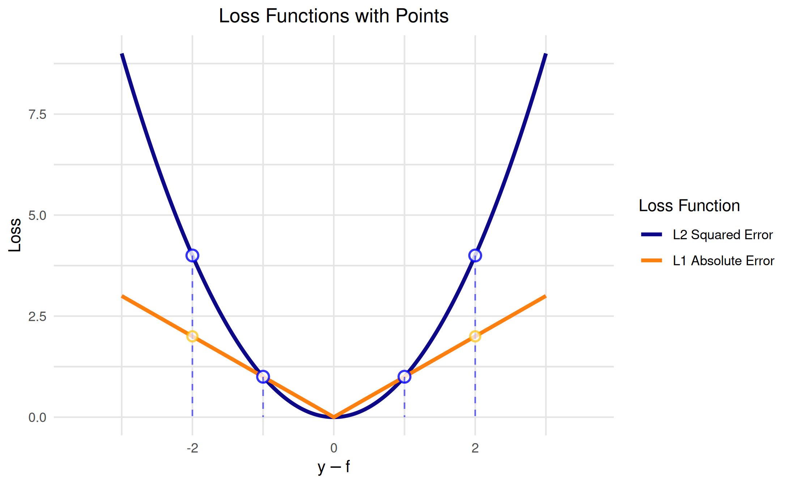
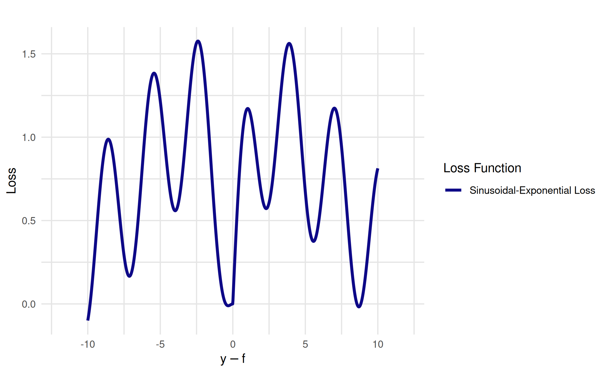

# Loss functions

``` r
library(vistool)
set.seed(1)
options(vistool.theme = vistool_theme(
  palette = "plasma"
))
```

Loss functions are wrapped in `LossFunction` objects. The package
includes predefined loss functions for both regression and
classification tasks. Classification loss functions can work with
different input scales (scores vs. probabilities).

``` r
as.data.table(dict_loss)
#> Key: <key>
#>                     key                    label task_type
#>                  <char>                   <char>    <char>
#>  1:               brier              Brier Score   classif
#>  2:              cauchy              Cauchy Loss      regr
#>  3:       cross-entropy            Logistic Loss   classif
#>  4: epsilon-insensitive Epsilon-Insensitive Loss      regr
#>  5:               hinge               Hinge Loss   classif
#>  6:               huber               Huber Loss      regr
#>  7:               l1_ae        L1 Absolute Error      regr
#>  8:               l2_se         L2 Squared Error      regr
#>  9:         log-barrier         Log-Barrier Loss      regr
#> 10:            log-cosh            Log-Cosh Loss      regr
#> 11:             pinball             Pinball Loss      regr
#> 12:            zero-one                 0-1 Loss   classif
```

To get a loss function from the dictionary, use the
[`lss()`](https://slds-lmu.github.io/vistool/reference/lss.md) function.
Some loss functions support parameters (e.g., `quantile` for pinball
loss, `delta` for Huber loss, `epsilon` for epsilon-insensitive loss).
You can specify these parameters directly in the
[`lss()`](https://slds-lmu.github.io/vistool/reference/lss.md) function
call. Here we retrieve the pinball loss function for regression with a
custom quantile parameter.

``` r
loss_function = lss("pinball", quantile = 0.3)
```

*You can also refer to loss functions via common `mlr3` **measure IDs**
(e.g., `regr.mse`). These are translated internally to the corresponding
`vistool` loss keys.*

## Visualization

To visualize a loss function, use the
[`as_visualizer()`](https://slds-lmu.github.io/vistool/reference/as_visualizer.md)
function. For regression losses, the input represents residuals
$r = y - f(x)$. For classification losses, the input can be either
margins $y \cdot f(x)$ (score-based) or probabilities $\pi$
(probability-based). By default, loss functions are plotted with 1000
points for smooth curves.

``` r
vis = as_visualizer(loss_function, y_pred = seq(-4, 4), y_true = 0)
```

Use the [`plot()`](https://rdrr.io/r/graphics/plot.default.html) method
to plot the loss function.

``` r
vis$plot()
```


## Regression loss functions

Here we visualize multiple regression loss functions:

``` r
loss_huber = lss("regr.huber") # or simply "huber"
loss_l2 = lss("l2_se")
loss_l1 = lss("l1_ae")
loss_logcosh = lss("log-cosh")

vis_combined = as_visualizer(
  list(loss_huber, loss_l2, loss_l1, loss_logcosh),
  y_pred = seq(-4, 4),
  y_true = 0,
  n_points = 5000L # higher resolution for smooth curves
)
vis_combined$plot()
```


## Classification loss functions

Classification loss functions can operate on different input scales
depending on the loss function. Some work with scores, while others work
with probabilities.

### Score-based classification losses

Score-based losses operate on the margin $y \cdot f(x)$ where
$y \in \{ - 1, + 1\}$ and $f(x)$ is the prediction score:

``` r
hinge_loss = lss("hinge")
crossentropy_loss = lss("cross-entropy")

vis_scores = as_visualizer(
  list(hinge_loss, crossentropy_loss),
  input_type = "score"
)
vis_scores$plot()
```


### Probability-based classification losses

Probability-based losses operate on predicted probabilities
$\pi \in \lbrack 0,1\rbrack$. The cross-entropy loss can be expressed in
both score and probability forms, while the Brier score is naturally
probability-based:

``` r
brier_loss = lss("brier")

vis_probs = as_visualizer(
  list(crossentropy_loss, brier_loss),
  input_type = "probability"
)
vis_probs$plot()
```



### Controlling which class curves to display

When visualizing probability-based losses, you can control whether to
show curves for the positive class (`y = 1`), negative class (`y = 0`),
or both (default) using the `y_curves` parameter:

``` r
vis_y1 = as_visualizer(
  list(crossentropy_loss, brier_loss),
  input_type = "probability"
)
vis_y1$plot(y_curves = "y1") # Only show y = 1 curve
```



## Adding points to loss function visualizations

You can add specific points to loss function plots to highlight
particular residual values and their corresponding loss values. The
`add_points()` method automatically calculates the y-coordinates by
evaluating the loss function at the given x-coordinates.

``` r
vis_with_points = as_visualizer(
  list(loss_l2, loss_l1),
  y_pred = seq(-3, 3),
  y_true = 0
)

vis_with_points$add_points(
  x = c(-2, -1, 1, 2),
  loss_id = "l2",
  show_line = TRUE,
  color = "blue",
  size = 3,
  alpha = 0.8
)$add_points(
  x = c(-2, 2),
  loss_id = "l1", # Specify the L1 loss
  show_line = FALSE,
  color = "#febf01",
  size = 2.5,
  alpha = 0.7
)

vis_with_points$plot(
  plot_title = "Loss Functions with Points",
  show_legend = TRUE
)
```



## Custom loss functions

We can also define and visualize custom loss functions:

``` r
custom_loss = LossFunction$new(
  id = "custom_loss",
  label = "Sinusoidal-Exponential Loss",
  task_type = "regr",
  fun = function(r) abs(r) * exp(-abs(r) / 3) + 0.5 * sin(2 * r)
)

vis = as_visualizer(custom_loss, y_pred = seq(-10, 10), y_true = 0, n_points = 5000L)
vis$plot()
```



## See also

- [Model
  predictions](https://slds-lmu.github.io/vistool/articles/model.md)
- [Objective
  functions](https://slds-lmu.github.io/vistool/articles/objective.md)
- [Optimization &
  traces](https://slds-lmu.github.io/vistool/articles/optimization_traces.md)
- [Customization
  guide](https://slds-lmu.github.io/vistool/articles/customization_guide.md)
- [Advanced
  visualization](https://slds-lmu.github.io/vistool/articles/advanced_visualization.md)
