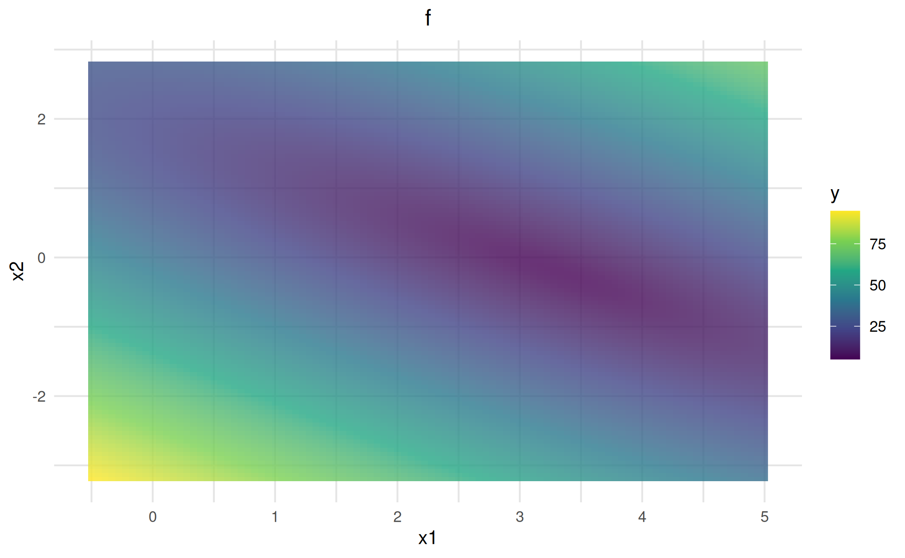

# Objective functions

``` r
library(vistool)
library(plotly)
library(purrr)
set.seed(1)
```

This vignette covers the basic usage of objective functions in
`vistool`, including predefined objectives and how to define custom
objectives.

## Predefined objectives

The package provides a dictionary of objective functions:

``` r
as.data.table(dict_objective)
#> Key: <key>
#>                        key               label  xdim     lower   upper
#>                     <char>              <char> <int>    <list>  <list>
#>  1:           TF_Gfunction           Gfunction    NA        NA      NA
#>  2:      TF_GoldsteinPrice      GoldsteinPrice     2       0,0     1,1
#>  3:   TF_GoldsteinPriceLog   GoldsteinPriceLog     2       0,0     1,1
#>  4:         TF_OTL_Circuit         OTL_Circuit     6        NA      NA
#>  5:          TF_RoosArnold          RoosArnold    NA        NA      NA
#>  6:              TF_ackley              ackley     2       0,0     1,1
#>  7:              TF_banana              banana     2       0,0     1,1
#>  8:               TF_beale               beale     2       0,0     1,1
#>  9:            TF_borehole            borehole     2       0,0 1.5,1.0
#> 10:              TF_branin              branin     2     -5, 0   10,15
#> 11:          TF_currin1991          currin1991     2       0,0     1,1
#> 12:               TF_easom               easom     2       0,0     1,1
#> 13:              TF_franke              franke     2 -0.5,-0.5     1,1
#> 14:           TF_gaussian1           gaussian1    NA        NA      NA
#> 15:            TF_griewank            griewank    NA        NA      NA
#> 16:            TF_hartmann            hartmann     6        NA      NA
#> 17:                TF_hump                hump     2       0,0     1,1
#> 18:                TF_levy                levy    NA        NA      NA
#> 19: TF_linkletter_nosignal linkletter_nosignal    NA        NA      NA
#> 20:         TF_michalewicz         michalewicz    NA        NA      NA
#> 21:              TF_piston              piston     7        NA      NA
#> 22:              TF_powsin              powsin    NA        NA      NA
#> 23:          TF_quad_peaks          quad_peaks     2       0,0     1,1
#> 24:    TF_quad_peaks_slant    quad_peaks_slant     2       0,0     1,1
#> 25:           TF_rastrigin           rastrigin    NA        NA      NA
#> 26:            TF_robotarm            robotarm     8        NA      NA
#> 27:            TF_sinumoid            sinumoid     2       0,0     1,1
#> 28:             TF_sqrtsin             sqrtsin    NA        NA      NA
#> 29:           TF_waterfall           waterfall     2       0,0     1,1
#> 30:          TF_wingweight          wingweight    10        NA      NA
#> 31:            TF_zhou1998            zhou1998     2       0,0     1,1
#> 32:                 linreg  squared error risk     2        NA      NA
#> 33:                 logreg       logistic risk     2        NA      NA
#>                        key               label  xdim     lower   upper
```

To retrieve an objective function:

``` r
obj_branin = obj("TF_branin")
```

You can evaluate the objective, gradient, and Hessian at a point:

``` r
x = c(0.9, 1)
obj_branin$eval(x)
#> [1] 29.45415
obj_branin$grad(x)
#> [1] -17.50288  -7.34449
obj_branin$hess(x)
#>           [,1]      [,2]
#> [1,] -71.05427   0.00000
#> [2,]   0.00000 -28.18265
```

## Objective transformations

Objective instances can apply scalar transformations to their values
while keeping gradients and Hessians consistent. This is useful when you
want to inspect a log-scaled risk surface without re-implementing the
underlying model objective.

``` r
log_design = matrix(c(-1, 0, 1, 2), ncol = 1)
log_response = c(0, 1, 0, 1)

obj_logistic = objective_logistic(log_design, log_response)
obj_logistic_log = objective_logistic(
  log_design,
  log_response,
  transform = objective_transform_log()
)

theta = c(0.2, -0.4)
c(
  identity = obj_logistic$eval(theta),
  log = obj_logistic_log$eval(theta)
)
#>   identity        log 
#>  0.4089067 -0.8942683
obj_logistic_log$transform_id
#> [1] "log"

obj_logistic$set_transform(objective_transform_log())
obj_logistic$label
#> [1] "logistic risk (log)"
```

## Visualizing objectives

Use
[`as_visualizer()`](https://slds-lmu.github.io/vistool/reference/as_visualizer.md)
to create a visualizer for an objective. For 1D and 2D objectives, the
appropriate visualizer is selected automatically. 2D objectives
additionally support interactive surface visualization:

``` r
vis_surface = as_visualizer(obj_branin, type = "surface")
vis_surface$plot()
```

## Custom objectives

You can define your own objective function. Let’s define a loss for a
linear model on the iris data with target `Sepal.Width` and feature
`Petal.Width`. First, an `Objective` requires a function for evaluation:

``` r
# Define the linear model loss function as SSE:
l2norm = function(x) sqrt(sum(crossprod(x)))

mylm = function(x, Xmat, y) {
  l2norm(y - Xmat %*% x)
}
```

To fix the loss for the data, the `Objective$new()` call allows to pass
custom arguments that are stored and reused in every call to `$eval()`
to evaluate `fun`. So, calling `$eval(x)` internally calls
`fun(x, ...)`. These arguments must be specified just once:

``` r
# Use the iris dataset with response `Sepal.Width` and feature `Petal.Width`:
Xmat = model.matrix(~Petal.Width, data = iris)
y = iris$Sepal.Width

# Create a new object:
obj_lm = Objective$new(id = "iris LM", fun = mylm, xdim = 2, Xmat = Xmat, y = y, minimize = TRUE)

obj_lm$eval_store(c(1, 2))
obj_lm$eval_store(c(2, 3))
obj_lm$eval_store(coef(lm(Sepal.Width ~ Petal.Width, data = iris)))

obj_lm$archive
#>                        x      fval                      grad        gnorm
#>                   <list>     <num>                    <list>        <num>
#> 1:                   1,2 21.553654        2.375467,11.722838 1.196109e+01
#> 2:                   2,3 43.410022        8.779078,16.929270 1.907020e+01
#> 3:  3.3084256,-0.2093598  4.951004 4.832272e-07,2.664535e-07 5.518206e-07
```

Visualize the custom objective:

``` r
vis_lm = as_visualizer(obj_lm, x1_limits = c(-0.5, 5), x2_limits = c(-3.2, 2.8))
vis_lm$add_contours()$plot()
```


You can also add custom points directly to the visualizer using
`$add_points()`, which supports many customization options (see below).
For adding actual optimization traces, see the [Optimization & traces
vignette](https://slds-lmu.github.io/vistool/articles/optimization_traces.md).

``` r
archive_data = data.frame(
  x = sapply(obj_lm$archive$x, function(x) x[1]),
  y = sapply(obj_lm$archive$x, function(x) x[2])
)
vis_lm$add_points(archive_data, color = "orange", size = 3, shape = 17, alpha = 0.8, ordered = TRUE)$plot()
```



*Customization options include: `points` (as data.frame/matrix/list),
`color`, `size`, `shape`, `alpha`, `annotations`, `ordered`, and more.
See the documentation for all arguments.*

## All 2D objectives

From the
[`TestFunctions`](https://CRAN.R-project.org/web/packages/TestFunctions/vignettes/AnIntroductiontoTestFunctions.html)
package.

## See also

- [Loss
  functions](https://slds-lmu.github.io/vistool/articles/loss_functions.md)
- [Model
  predictions](https://slds-lmu.github.io/vistool/articles/model.md)
- [Optimization &
  traces](https://slds-lmu.github.io/vistool/articles/optimization_traces.md)
- [Customization
  guide](https://slds-lmu.github.io/vistool/articles/customization_guide.md)
- [Advanced
  visualization](https://slds-lmu.github.io/vistool/articles/advanced_visualization.md)
