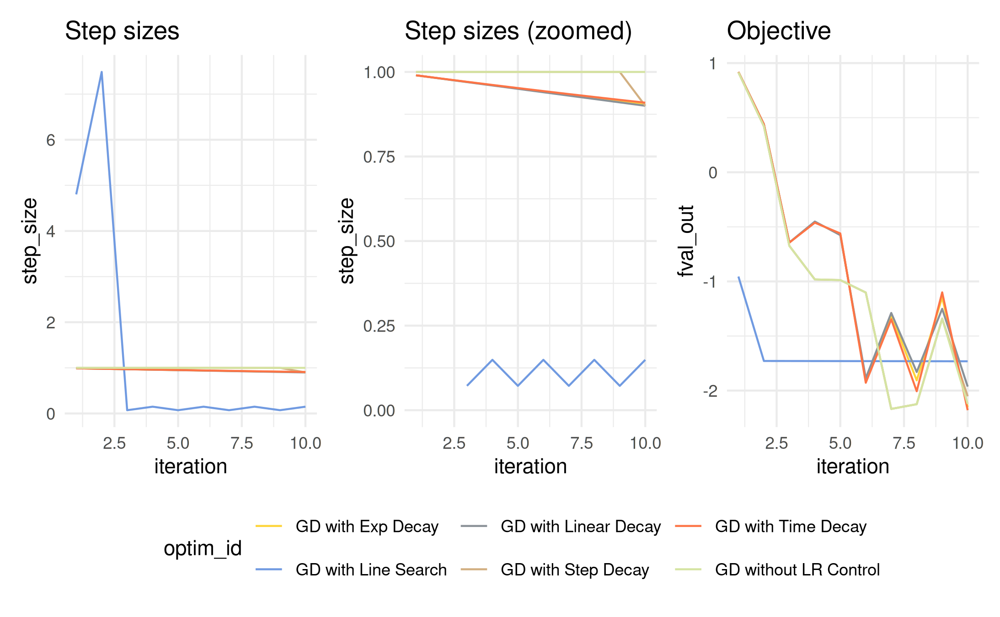

# Optimization & traces

``` r
library(vistool)
library(plotly)
library(purrr)
set.seed(1)
```

This vignette covers the available optimizers, step size control, and
how to visualize optimization traces.

## Optimizers

The optimizer class defines the optimization strategy and is initialized
by taking an objective function, start value, and learning rate.
Available optimizers are:

- Gradient descent with `OptimizerGD`
- Momentum with `OptimizerMomentum`
- Nesterov’s momentum with `OptimizerNAG`

Creating an optimizer is done by (let’s use an x value that works well):

``` r
obj = obj("TF_GoldsteinPriceLog")
opt = OptimizerGD$new(obj, x_start = c(0.22, 0.77), lr = 0.01)
```

With these values set, run `$optimize()` with the number of steps:

``` r
opt$optimize(10L)
#> TF_GoldsteinPriceLog: Batch 1 step 1: f(x) = 0.9158, x = c(0.219, 0.7186)
#> TF_GoldsteinPriceLog: Batch 1 step 2: f(x) = 0.4217, x = c(0.211, 0.6549)
#> TF_GoldsteinPriceLog: Batch 1 step 3: f(x) = -0.6741, x = c(0.1844, 0.5649)
#> TF_GoldsteinPriceLog: Batch 1 step 4: f(x) = -0.9819, x = c(0.2182, 0.5224)
#> TF_GoldsteinPriceLog: Batch 1 step 5: f(x) = -0.9876, x = c(0.2992, 0.5105)
#> TF_GoldsteinPriceLog: Batch 1 step 6: f(x) = -1.1018, x = c(0.2625, 0.3598)
#> TF_GoldsteinPriceLog: Batch 1 step 7: f(x) = -2.168, x = c(0.3405, 0.4107)
#> TF_GoldsteinPriceLog: Batch 1 step 8: f(x) = -2.1246, x = c(0.3448, 0.3898)
#> TF_GoldsteinPriceLog: Batch 1 step 9: f(x) = -1.3408, x = c(0.4093, 0.4614)
#> TF_GoldsteinPriceLog: Batch 1 step 10: f(x) = -2.1225, x = c(0.3729, 0.3911)
```

Calling `$optimize()` also writes into the archive of the optimizer and
also calls `$eval_store()` of the objective. Therefore, `$optimize()`
writes into two archives:

``` r
opt$archive
#>                   x_out                x_in                    update
#>                  <list>              <list>                    <list>
#>  1: 0.2189909,0.7185977           0.22,0.77 -0.001009067,-0.051402328
#>  2: 0.2109802,0.6548741 0.2189909,0.7185977   -0.00801070,-0.06372357
#>  3: 0.1844147,0.5648984 0.2109802,0.6548741   -0.02656552,-0.08997572
#>  4: 0.2182254,0.5223500 0.1844147,0.5648984    0.03381065,-0.04254834
#>  5: 0.2992118,0.5105193 0.2182254,0.5223500    0.08098642,-0.01183078
#>  6: 0.2625368,0.3597982 0.2992118,0.5105193   -0.03667496,-0.15072102
#>  7: 0.3405450,0.4106795 0.2625368,0.3597982     0.07800819,0.05088128
#>  8: 0.3448264,0.3897982 0.3405450,0.4106795  0.004281407,-0.020881313
#>  9: 0.4092595,0.4613701 0.3448264,0.3897982     0.06443313,0.07157191
#> 10: 0.3728515,0.3910876 0.4092595,0.4613701   -0.03640808,-0.07028256
#>       fval_out    fval_in    lr step_size         objective_id momentum  step
#>          <num>      <num> <num>     <num>               <char>    <num> <int>
#>  1:  0.9157526  1.2102644  0.01         1 TF_GoldsteinPriceLog        0     1
#>  2:  0.4217145  0.9157526  0.01         1 TF_GoldsteinPriceLog        0     2
#>  3: -0.6741307  0.4217145  0.01         1 TF_GoldsteinPriceLog        0     3
#>  4: -0.9818620 -0.6741307  0.01         1 TF_GoldsteinPriceLog        0     4
#>  5: -0.9876309 -0.9818620  0.01         1 TF_GoldsteinPriceLog        0     5
#>  6: -1.1017546 -0.9876309  0.01         1 TF_GoldsteinPriceLog        0     6
#>  7: -2.1680122 -1.1017546  0.01         1 TF_GoldsteinPriceLog        0     7
#>  8: -2.1245834 -2.1680122  0.01         1 TF_GoldsteinPriceLog        0     8
#>  9: -1.3408109 -2.1245834  0.01         1 TF_GoldsteinPriceLog        0     9
#> 10: -2.1225452 -1.3408109  0.01         1 TF_GoldsteinPriceLog        0    10
#>     batch
#>     <num>
#>  1:     1
#>  2:     1
#>  3:     1
#>  4:     1
#>  5:     1
#>  6:     1
#>  7:     1
#>  8:     1
#>  9:     1
#> 10:     1
opt$objective$archive
#>                       x       fval                  grad     gnorm
#>                  <list>      <num>                <list>     <num>
#>  1:           0.22,0.77  1.2102644   0.1009067,5.1402328  5.141223
#>  2: 0.2189909,0.7185977  0.9157526     0.801070,6.372357  6.422511
#>  3: 0.2109802,0.6548741  0.4217145     2.656552,8.997572  9.381555
#>  4: 0.1844147,0.5648984 -0.6741307   -3.381065, 4.254834  5.434631
#>  5: 0.2182254,0.5223500 -0.9818620   -8.098642, 1.183078  8.184600
#>  6: 0.2992118,0.5105193 -0.9876309    3.667496,15.072102 15.511892
#>  7: 0.2625368,0.3597982 -1.1017546   -7.800819,-5.088128  9.313529
#>  8: 0.3405450,0.4106795 -2.1680122 -0.4281407, 2.0881313  2.131571
#>  9: 0.3448264,0.3897982 -2.1245834   -6.443313,-7.157191  9.630247
#> 10: 0.4092595,0.4613701 -1.3408109     3.640808,7.028256  7.915293
```

## Visualize optimization traces

A layer of the `Visualizer` class is `$add_optimization_trace()` that
gets the optimizer as argument and adds the optimization trace to the
plot:

``` r
vis = as_visualizer(obj, type = "surface")
vis$add_optimization_trace(opt, name = "GD")
vis$plot()
```

## Step size control

`$optimize()` accepts a second argument `step_size_control` to scale the
parameter update. For GD with
$x_{\text{new}} = x_{\text{old}} + lr*\Delta_{f}\left( x_{\text{old}} \right)$,
the update $u = lr*\Delta_{f}\left( x_{\text{old}} \right)$ is
multiplied by the return value of `step_size_control()`. There are a few
pre-implemented control functions like line search or various decaying
methods:

- `step_size_control_line_search(lower, upper)`: Conduct a line search
  for $a$ in
  $x_{\text{new}} = x_{\text{old}} + a \cdot lr \cdot \Delta_{f}\left( x_{\text{old}} \right)$.
- `step_size_control_decay_time(decay)`: Lower the updates by
  $(1 + decay*iteration)^{- 1}$.
- `step_size_control_decay_exp(decay)`: Lower the updates by
  $exp( - decay*iteration)$.
- `step_size_control_decay_linear(iter_zero)`: Lower the updates until
  `iter_zero` is reached. Updates with `iter > iter_zero` are 0.
- `step_size_control_decay_steps(drop_rate, every_iter)`: Lower the
  updates `every_iter` by `drop_rate`.

Note that these functions return a function that contains a function
with the required signature:

``` r
step_size_control_decay_time()
#> function (x, u, obj, opt) 
#> {
#>     assert_step_size_control(x, u, obj, opt)
#>     epoch = nrow(obj$archive)
#>     return(1/(1 + decay * epoch))
#> }
#> <bytecode: 0x56538a7862a8>
#> <environment: 0x56538a7858d0>
```

Let’s define multiple gradient descent optimizers and optimize 10 steps
with a step size control:

``` r
x0 = c(0.22, 0.77)
lr = 0.01

oo1 = OptimizerGD$new(obj, x_start = x0, lr = lr, id = "GD without LR Control", print_trace = FALSE)
oo2 = OptimizerGD$new(obj, x_start = x0, lr = lr, id = "GD with Line Search", print_trace = FALSE)
oo3 = OptimizerGD$new(obj, x_start = x0, lr = lr, id = "GD with Time Decay", print_trace = FALSE)
oo4 = OptimizerGD$new(obj, x_start = x0, lr = lr, id = "GD with Exp Decay", print_trace = FALSE)
oo5 = OptimizerGD$new(obj, x_start = x0, lr = lr, id = "GD with Linear Decay", print_trace = FALSE)
oo6 = OptimizerGD$new(obj, x_start = x0, lr = lr, id = "GD with Step Decay", print_trace = FALSE)

oo1$optimize(steps = 10)
oo2$optimize(steps = 10, step_size_control_line_search())
oo3$optimize(steps = 10, step_size_control_decay_time())
oo4$optimize(steps = 10, step_size_control_decay_exp())
oo5$optimize(steps = 10, step_size_control_decay_linear())
oo6$optimize(steps = 10, step_size_control_decay_steps())
```

For now we don’t know how well it worked. Let’s collect all archives
with
[`merge_optim_archives()`](https://slds-lmu.github.io/vistool/reference/merge_optim_archives.md)
and visualize the step sizes and function values with `patchwork` magic:

``` r
arx = merge_optim_archives(oo1, oo2, oo3, oo4, oo5, oo6)

library(ggplot2)
library(patchwork)
gg1 = ggplot(arx, aes(x = iteration, y = step_size, color = optim_id))
gg2 = ggplot(arx, aes(x = iteration, y = fval_out, color = optim_id))

(gg1 + ggtitle("Step sizes") |
  gg1 + ylim(0, 1) + ggtitle("Step sizes (zoomed)") |
  gg2 + ggtitle("Objective")) +
  plot_layout(guides = "collect") &
  geom_line() &
  theme_minimal() &
  theme(legend.position = "bottom") &
  ggsci::scale_color_simpsons()
#> Warning: Removed 2 rows containing missing values or values outside the scale range
#> (`geom_line()`).
```



Visualizing the traces is done as before by adding optimization trace
layer. We can do this for all optimizers to add multiple traces to the
plot:

``` r
vis = as_visualizer(obj, type = "surface")

vis$add_optimization_trace(oo1)
vis$add_optimization_trace(oo2)
vis$add_optimization_trace(oo3)
vis$add_optimization_trace(oo4)
vis$add_optimization_trace(oo5)
vis$add_optimization_trace(oo6)

vis$plot()
```

Practically, it should be no issue to also combine multiple control
functions. The important thing is to keep the signature of the function
by allowing the function to get the arguments `x` (current value), `u`
(current update), `obj` (`Objective` object), and `opt` (`Optimizer`
object):

``` r
myStepSizeControl = function(x, u, obj, opt) {
  sc1 = step_size_control_line_search(0, 10)
  sc2 = step_size_control_decay_time(0.1)
  return(sc1(x, u, obj, opt) * sc2(x, u, obj, opt))
}

my_oo = OptimizerGD$new(obj, x_start = x0, lr = lr, id = "GD without LR Control", print_trace = FALSE)
my_oo$optimize(100, myStepSizeControl)
tail(my_oo$archive)
#>        x_out      x_in                      update  fval_out   fval_in    lr
#>       <list>    <list>                      <list>     <num>     <num> <num>
#> 1: 0.50,0.25 0.50,0.25  4.440892e-10,-3.996803e-09 -3.129126 -3.129126  0.01
#> 2: 0.50,0.25 0.50,0.25 -2.664535e-09,-7.105427e-09 -3.129126 -3.129126  0.01
#> 3: 0.50,0.25 0.50,0.25 -3.552714e-09,-3.552714e-09 -3.129126 -3.129126  0.01
#> 4: 0.50,0.25 0.50,0.25   8.881784e-10,7.549517e-09 -3.129126 -3.129126  0.01
#> 5: 0.50,0.25 0.50,0.25  0.000000e+00,-1.021405e-08 -3.129126 -3.129126  0.01
#> 6: 0.50,0.25 0.50,0.25   8.881784e-10,0.000000e+00 -3.129126 -3.129126  0.01
#>      step_size         objective_id momentum  step batch
#>          <num>               <char>    <num> <int> <num>
#> 1: 0.015061886 TF_GoldsteinPriceLog        0    95     1
#> 2: 0.006942669 TF_GoldsteinPriceLog        0    96     1
#> 3: 0.010225887 TF_GoldsteinPriceLog        0    97     1
#> 4: 0.063947308 TF_GoldsteinPriceLog        0    98     1
#> 5: 0.006044013 TF_GoldsteinPriceLog        0    99     1
#> 6: 0.564836746 TF_GoldsteinPriceLog        0   100     1
```

## Customization options

Let’s optimize a custom linear model objective (see the [Objective
functions
vignette](https://slds-lmu.github.io/vistool/articles/objective.md))
using the three available optimizers.

``` r
# Define the linear model loss function as SSE:
l2norm = function(x) sqrt(sum(crossprod(x)))

mylm = function(x, Xmat, y) {
  l2norm(y - Xmat %*% x)
}
# Use the iris dataset with response `Sepal.Width` and feature `Petal.Width`:
Xmat = model.matrix(~Petal.Width, data = iris)
y = iris$Sepal.Width

# Create a new object:
obj_lm = Objective$new(id = "iris LM", fun = mylm, xdim = 2, Xmat = Xmat, y = y, minimize = TRUE)

oo1 = OptimizerGD$new(obj_lm, x_start = c(0, -0.05), lr = 0.001, print_trace = FALSE)
oo2 = OptimizerMomentum$new(obj_lm, x_start = c(3, 2), lr = 0.001, print_trace = FALSE)
oo3 = OptimizerNAG$new(obj_lm, x_start = c(1, -2), lr = 0.001, print_trace = FALSE)

oo1$optimize(steps = 100)
oo2$optimize(steps = 100)
oo3$optimize(steps = 100)
```

Optimization traces support many customization options (see the
[Customization
guide](https://slds-lmu.github.io/vistool/articles/customization_guide.md)):

``` r
vis = as_visualizer(obj_lm, x1_limits = c(-0.5, 5), x2_limits = c(-3.2, 2.8), type = "surface")


vis$add_optimization_trace(oo1, add_marker_at = round(seq(1, 100, len = 10L)))
vis$add_optimization_trace(oo2, line_color = "yellow", add_marker_at = c(1, 50, 90), marker_shape = c("square", "diamond", "cross"))
vis$add_optimization_trace(oo3, line_color = "red", line_width = 20, line_type = "dashed")

vis$plot()
```

We can also use the alternative `ggplot2` backend:

``` r
vis_2d = as_visualizer(obj_lm, x1_limits = c(-0.5, 5), x2_limits = c(-3.2, 2.8))

vis_2d$add_optimization_trace(oo1, name = "Gradient Descent")
vis_2d$add_optimization_trace(oo2, line_type = "dashed", name = "Momentum")
vis_2d$add_optimization_trace(oo3, line_type = "dotted", name = "Nesterov AG")

vis_2d$plot()
```


## See also

- [Loss
  functions](https://slds-lmu.github.io/vistool/articles/loss_functions.md)
- [Model
  predictions](https://slds-lmu.github.io/vistool/articles/model.md)
- [Objective
  functions](https://slds-lmu.github.io/vistool/articles/objective.md)
- [Customization
  guide](https://slds-lmu.github.io/vistool/articles/customization_guide.md)
- [Advanced
  visualization](https://slds-lmu.github.io/vistool/articles/advanced_visualization.md)
