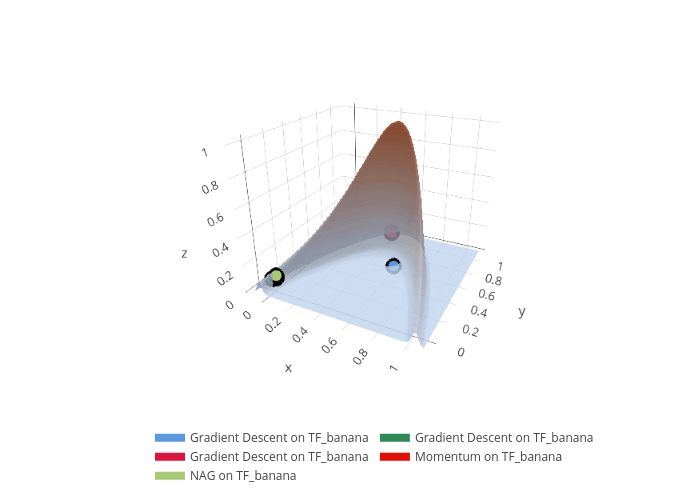
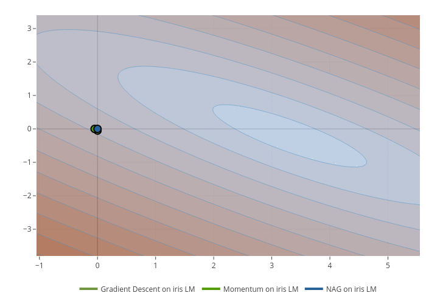

```{r, include = FALSE}
knitr::opts_chunk$set(
  collapse = TRUE,
  comment = "#>",
  dpi = 150,
  dev = "png",
  out.width = "100%",
  fig.retina = 2
)
```

```{r, message=FALSE}
library(vistool)
library(plotly)
library(purrr)
```

This vignette will cover advanced visualization options, overlays, manual layers, and animations.
Most of this section is a placeholder and will be expanded in future versions.

## Surface Visualization Options

For surface visualizations (`plotly`-based), you can customize the appearance directly when creating the visualizer or switch between surface and contour views.

```{r, out.width='100%', out.height='700px'}
viz <- as_visualizer(obj("TF_franke"), type = "surface", opacity = 1, 
                     colorscale = list(c(0, 1), c("white", "black")))
viz$plot()
```

To switch to a contour view:

```{r, out.width='100%', out.height='700px'}
viz$plot(flatten = TRUE)
```

The `contours` parameter allows you to specify custom contour lines on the x, y, and z axes:

```{r, out.width='100%', out.height='700px'}
viz <- as_visualizer(obj("TF_franke"), type = "surface")
llower <- viz$objective$limits_lower
lupper <- viz$objective$limits_upper
ssize <- (lupper - llower) / 10

viz <- as_visualizer(obj("TF_franke"), type = "surface", opacity = 1,
                     colorscale = list(c(0, 1), c("white", "black")),
                     contours = list(
                       y = list(show = TRUE, start = llower[2], end = lupper[2], size = ssize[2], color = "red")
                     ))
viz$plot()
```

## Setting the layout and scene

You can customize layout and scene directly in the `plot()` method:

```{r, out.width='100%', out.height='700px'}
viz <- as_visualizer(obj("TF_franke"), type = "surface")
viz$plot(layout = list(
  title = list(text = "Custom Title", font = list(size = 20)),
  showlegend = TRUE
))
```

```{r, out.width='100%', out.height='700px'}
viz$plot(scene = list(camera = list(eye = list(x = 1.5, y = 1.5, z = 1.5))))
```

```{r, out.width='100%', out.height='700px'}
viz$plot(
  layout = list(
    title = list(text = "Custom Title", font = list(size = 20))
    ),
  scene = list(
    xaxis = list(backgroundcolor = "red"),
    yaxis = list(backgroundcolor = "red"),
    zaxis = list(backgroundcolor = "red")
  )
)
```

## Overlaying layers (TODO)

```{r, out.width='100%', out.height='700px'}
obj <- obj("TF_banana")
# Use surface visualizer for surface features like surface, taylor, and hessian layers
viz <- as_visualizer(obj, type = "surface")

x0 <- c(0.85, 0.47)
viz$add_layer_taylor(x0, npoints_per_dim = 5, degree = 1, x1margin = 0.3, x2margin = 0.3, contours = list(
  x = list(show = TRUE, start = 0, end = 1, size = 0.03, color = "black"),
  y = list(show = TRUE, start = 0, end = 1, size = 0.03, color = "black")
))
viz$add_layer_hessian(x0)
viz$plot()
```

## Manual layers (TODO)

```{r, out.width='100%', out.height='700px'}
obj = obj("TF_banana")
viz = as_visualizer(obj, type = "surface", opacity = 0.5)
p = viz$plot()
class(p)

nsim = 100
grid = data.frame(x = runif(nsim), y = runif(nsim))
grid$z = apply(grid, 1, viz$objective$eval) + rnorm(nsim, sd = 0.05)
p %>% add_trace(data = grid, x = ~x, y = ~y, z = ~z, mode = "markers",
  type = "scatter3d", marker = list(symbol = "cross"))
```

## Animations (TODO)




**This section is under development and will be expanded.**

## ggplot2 Backend

You can use the ggplot2 backend for 2D objectives:

```{r, out.width='100%', out.height='700px'}
viz <- as_visualizer(obj("TF_franke"))
viz$plot()
```

Further customization:

```{r, out.width='100%', out.height='700px'}
library(ggplot2)
viz <- as_visualizer(obj("TF_franke"))
p <- viz$plot()
p + labs(title = "TF Franke Function")
```
